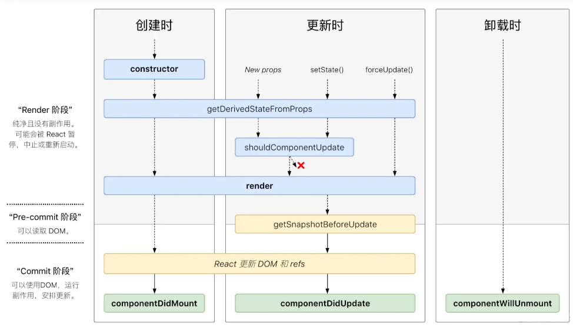
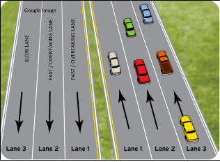

# React大厂面试30问

## React架构图


本页考题为多年实践高频考题,但不承诺覆盖100%面试题。

---

## 1. API高频考题

### 高阶组件(HOC)是什么?你在业务中使用过解决了什么问题?

**答案:**

HOC本质上是一个函数,它接收一个组件作为参数,然后返回一个新的组件。返回的新组件将拥有被包裹的组件的所有props,并且可以添加额外的props或状态。

HOC可以用于抽象出组件之间的共享代码,以增强组件的复用性和可维护性。也可以用于控制props,封装组件状态,或者通过引用(ref)来访问组件实例。

例如,以下是一个简单的HOC示例:

```javascript
function withExtraProp(Component) {
  return function(props) {
    return <Component extraProp="someValue" {...props} />;
  };
}
```

在这个示例中,`withExtraProp`是一个HOC,它接收一个组件`Component`,然后返回一个新的组件,新的组件会向`Component`添加一个额外的prop。

**在业务中可能会使用到HOC的例子:**

1. **授权和权限管理**:例如,你可能有一些组件只允许认证过的用户访问。你可以创建一个HOC,它接收一个组件并返回一个新的组件,新的组件在渲染之前会检查用户是否已经认证。

2. **数据获取**:另一个常见的HOC用例是用于数据获取。例如,你可以创建一个HOC,它接收一个组件并返回一个新的组件,新的组件在挂载时获取数据,并将数据通过props传递给被包裹的组件。

3. **错误处理**:你可以创建一个HOC,它接收一个组件并返回一个新的组件,新的组件包裹原组件的渲染,并在发生错误时显示错误信息或其他备用内容。

---

### 什么时候应该使用类组件而不是函数组件?React组件错误捕获怎么做?

**答案:**

在早期的React版本中,类组件和函数组件有明显的区别。类组件提供了生命周期方法(例如`componentDidMount`, `componentDidUpdate`等)和state,而函数组件则是无状态的,并且没有生命周期方法。因此,如果你的组件需要维护状态或者需要使用生命周期方法,那么你需要使用类组件。

然而,从React 16.8版本开始,引入了Hooks特性,允许在函数组件中使用状态(`useState`)和生命周期方法(`useEffect`)。所以,目前你几乎在所有场景下都可以使用函数组件替代类组件。

不过,有一个情况下,你可能还需要使用类组件,那就是**错误边界(Error Boundaries)**。错误边界是React中的一种特性,它允许你在子组件树中捕获JavaScript错误,并在发生错误时显示备用内容,而不是让整个组件树崩溃。错误边界在React中只能通过类组件来实现。

以下是一个简单的错误边界类组件示例:

```javascript
class ErrorBoundary extends React.Component {
  constructor(props) {
    super(props);
    this.state = { hasError: false };
  }

  static getDerivedStateFromError(error) {
    return { hasError: true };
  }

  componentDidCatch(error, errorInfo) {
    logErrorToService(error, errorInfo);
  }

  render() {
    if (this.state.hasError) {
      return <h1>Something went wrong.</h1>;
    }

    return this.props.children;
  }
}
```

然后你可以像这样使用`ErrorBoundary`组件来包裹其它组件:

```jsx
<ErrorBoundary>
  <MyWidget />
</ErrorBoundary>
```

这样,如果`MyWidget`组件或者它的子组件在渲染过程中发生错误,`ErrorBoundary`就会捕获到这个错误,并显示备用UI,而不会导致整个应用崩溃。

**\[深度拓展\] 关于错误捕获的进一步讨论:**

虽然官方的错误边界仍然需要类组件实现,但社区提供了更优雅的解决方案:

```javascript
// react-error-boundary库，无需类组件
import { ErrorBoundary } from 'react-error-boundary';

function FallbackComponent({ error, resetErrorBoundary }) {
  return (
    <div>
      <h2>Something went wrong!</h2>
      <pre>{error.message}</pre>
      <button onClick={resetErrorBoundary}>Try again</button>
    </div>
  );
}

function App() {
  return (
    <ErrorBoundary FallbackComponent={FallbackComponent}>
      <YourComponent />
    </ErrorBoundary>
  );
}
```

**react-error-boundary的优势:**

1. **纯函数组件**：无需类组件，符合现代React开发风格
2. **类型安全**：优秀的TypeScript支持
3. **细粒度控制**：支持reset keys、fallback props等
4. **与Suspense配合**：可以与React 18的Suspense配合使用

**未来展望：函数式错误边界**

React团队已在RFC中讨论函数式错误边界，但尚未正式发布。以下是可能的方向：

```javascript
// 可能的未来API（实验性）
function useErrorBoundary() {
  return { error: null, resetError: () => {} };
}

function ComponentWithErrorBoundary() {
  const { error, resetError } = useErrorBoundary();

  if (error) {
    return <ErrorFallback error={error} onRetry={resetError} />;
  }

  return <ChildComponent />;
}
```

---

### 如何在React中对props应用验证?

**答案:**

React提供了一个名为`PropTypes`的库,可以用于在开发环境下验证传递给组件的props是否符合期望的类型。

以下是使用`PropTypes`的基本示例:

```javascript
import PropTypes from 'prop-types';

function MyComponent({ aStringProp, aNumberProp, aRequiredProp }) {
  return (
    <div>
      {aStringProp} - {aNumberProp} - {aRequiredProp}
    </div>
  );
}

MyComponent.propTypes = {
  aStringProp: PropTypes.string,
  aNumberProp: PropTypes.number,
  aRequiredProp: PropTypes.string.isRequired,
  optionalWithDefault: PropTypes.number,
  fontSize: PropTypes.number,
};
```

在上述代码中,`MyComponent.propTypes`对象定义了`MyComponent`组件所期望的props及其类型。例如,`aStringProp`应当是一个字符串,`aNumberProp`应当是一个数字,等等。如果`MyComponent`组件接收到类型不匹配的props,那么在开发环境下,控制台会打印出警告。

在这个例子中,`isRequired`属性被用来指明`aRequiredProp`是一个必须的props。如果它没有被提供,那么在开发环境下会有警告信息打印出来。

**注意:**

- `PropTypes`是在开发环境下运行的,对于生产环境不会产生任何影响。这意味着,`PropTypes`并不能保证代码在生产环境下的正确性。为了在生产环境下也能保证类型安全,你可能需要使用TypeScript或者Flow这样的静态类型检查工具。

- 从React 15.5.0版本开始,`PropTypes`不再内置在React中,而是从`'prop-types'`库中导入。

**在TypeScript中,你可以使用接口(Interfaces)或类型别名(Type Aliases)来进行类型验证。**

以下是一个简单的例子:

```typescript
interface MyComponentProps {
  aStringProp?: string;
  aNumberProp: number;
  aRequiredProp: string;
  optionalWithDefault?: number;
  fontSize?: number;
}

const MyComponent: React.FC<MyComponentProps> = ({
  aStringProp = 'default',
  aNumberProp,
  aRequiredProp,
  optionalWithDefault = 0,
  fontSize = 14,
}) => {
  return (
    <div style={{ fontSize }}>
      {aStringProp} - {aNumberProp} - {aRequiredProp} - {optionalWithDefault}
    </div>
  );
};
```

在上述代码中,我们首先定义了一个名为`MyComponentProps`的接口来描述`MyComponent`组件的props。在TypeScript中,可以使用`?`来表示一个属性是可选的。然后,我们用`React.FC<MyComponentProps>`来定义`MyComponent`组件的类型,这表明`MyComponent`是一个函数组件,它接收`MyComponentProps`类型的props。

使用TypeScript进行类型验证的好处是它不仅在开发环境下有效,而且在编译阶段就能捕获类型错误,从而提高代码质量和可维护性。

---

### React中如何创建Refs?创建Refs的方式有什么区别?

**答案:**

在React中,Refs主要用于获取和操作DOM元素或者React组件的实例,是一种逃脱props传递的方法。React中创建Refs的主要方式有两种:`React.createRef()`和回调Refs。

#### 1. React.createRef()

这是React 16.3版本后推出的新API,使用这种方式创建的Ref可以在整个组件的生命周期中保持不变。

```javascript
class MyComponent extends React.Component {
  constructor(props) {
    super(props);
    this.myRef = React.createRef();
  }

  componentDidMount() {
    const node = this.myRef.current; // 你现在可以访问DOM节点或者组件实例
  }

  render() {
    return <div ref={this.myRef} />;
  }
}
```

在上述代码中,`this.myRef`被赋值为`React.createRef()`的返回值。然后在`render`方法中,我们将`this.myRef`传递给了div的`ref`属性。这样,当div被挂载后,我们就可以在`this.myRef.current`中访问到div的DOM节点。

#### 2. 回调Refs

除了`React.createRef()`外,你还可以使用一个函数作为Ref。这个函数将会在组件挂载和卸载时分别被调用,并将DOM节点或组件实例作为参数。

```javascript
class MyComponent extends React.Component {
  constructor(props) {
    super(props);
    this.myRef = null;
    this.setMyRef = element => {
      this.myRef = element;
    };
  }

  componentDidMount() {
    // 你现在可以访问DOM节点或者组件实例
    console.log(this.myRef);
  }

  render() {
    return <div ref={this.setMyRef} />;
  }
}
```

在上述代码中,我们将一个函数传递给div的`ref`属性。当div被挂载后,这个函数就会被调用,并将div的DOM节点作为参数传入。然后我们将div的DOM节点赋值给`this.myRef`,这样就可以在其他地方访问到div的DOM节点。

**这两种Refs创建方式的主要区别在于:**

- `React.createRef()`创建的Ref更简洁,API更一致,而且Ref的值在组件的整个生命周期中保持不变。

- 回调Refs更灵活,它允许你在组件挂载和卸载时执行一些额外的逻辑。但是,如果回调函数是在`render`方法中定义的,那么每次render时都会创建一个新的函数实例,可能会导致一些性能问题。

总的来说,除非你有特殊需求,否则建议使用`React.createRef()`来创建Ref。

---

#### 在函数组件中创建Refs

在函数组件中,你可以使用`React.useRef()`和回调Refs来创建Refs。

##### 1. React.useRef()

这是React Hooks API的一部分,可以在函数组件中使用。使用`useRef`创建的Ref在整个组件的生命周期中保持不变。

```javascript
import React, { useRef, useEffect } from 'react';

function MyComponent() {
  const myRef = useRef(null);

  useEffect(() => {
    console.log(myRef.current); // 你现在可以访问DOM节点
  }, []);

  return <div ref={myRef} />;
}
```

在上述代码中,我们首先使用`useRef`创建了一个Ref,并将其赋值给`myRef`。然后,在`render`方法中,我们将`myRef`传递给div的`ref`属性。这样,当div被挂载后,我们就可以在`myRef.current`中访问到div的DOM节点。

##### 2. 回调Refs

你也可以在函数组件中使用回调Refs。这种方式下,你会提供一个函数,该函数会在组件挂载和卸载时分别被调用,并将DOM节点或组件实例作为参数。

```javascript
import React, { useEffect } from 'react';

function MyComponent() {
  const myRef = null;
  const setMyRef = element => {
    myRef = element;
  };

  useEffect(() => {
    console.log(myRef); // 你现在可以访问DOM节点
  }, []);

  return <div ref={setMyRef} />;
}
```

**这两种创建Ref的方式主要区别在于:**

- `React.useRef()`创建的Ref更简洁,API更一致,而且Ref的值在组件的整个生命周期中保持不变。

- 回调Refs更灵活,它允许你在组件挂载和卸载时执行一些额外的逻辑。但是,如果回调函数是在`render`方法中定义的,那么每次render时都会创建一个新的函数实例,可能会导致一些性能问题。

除非你有特殊需求,否则建议使用`React.useRef()`来创建Ref。

---

### createContext解决了什么问题?React父组件如何与子组件通信?子组件如何改变父组件的状态?

**答案:**

#### createContext解决了什么问题?

React的`createContext` API主要解决了props"穿透"的问题,即你需要把一个prop层层传递给深层嵌套的子组件。这在应用中有一些全局可用的数据时(如主题,用户信息等)非常有用。通过创建一个context,你可以让组件直接访问这些数据,无需通过props层层传递。

```javascript
import React, { createContext, useContext } from 'react';

// 创建一个context
const ThemeContext = createContext('light');

function App() {
  return (
    <ThemeContext.Provider value="dark">
      <Toolbar />
    </ThemeContext.Provider>
  );
}

function Toolbar() {
  return (
    <div>
      <ThemedButton />
    </div>
  );
}

function ThemedButton() {
  // 使用useContext Hook来消费context的值
  const theme = useContext(ThemeContext);
  return <button>{theme}</button>;
}
```

在上述代码中,我们首先使用`createContext`创建了一个`ThemeContext`。然后,我们在`App`组件中使用`ThemeContext.Provider`来提供context的值。最后,在`Button`组件中,我们使用`useContext` Hook来消费context的值。

#### React父组件如何与子组件通信?

父组件通过props向子组件传递数据和函数。子组件可以通过props获取到这些数据和函数。

#### 子组件如何改变父组件的状态?

子组件无法直接改变父组件的状态。但是,父组件可以通过props向子组件传递一个函数,子组件调用这个函数就能间接地改变父组件的状态。

```javascript
function Parent() {
  const [count, setCount] = useState(0);

  const handleIncrement = () => {
    setCount(count + 1);
  };

  return <Child count={count} onIncrement={handleIncrement} />;
}

function Child({ count, onIncrement }) {
  return (
    <div>
      <p>Count: {count}</p>
      <button onClick={onIncrement}>Increment</button>
    </div>
  );
}
```

在上述代码中,`Parent`组件向`Child`组件传递了一个名为`onIncrement`的函数。当`Child`组件的按钮被点击时,它就会调用`onIncrement`函数,从而间接地改变`Parent`组件的状态。

---

### memo有什么用途,useMemo和memo区别是什么?useCallback和useMemo有什么区别?

**答案:**

React中的`memo`是一个高阶组件,它用于优化组件的渲染性能。`memo`可以将一个纯函数组件(无状态组件)包装起来,以避免不必要的重新渲染。

- `useMemo`专用的hooks,缓存值。
- `useCallback`一般缓存我们的函数。

#### React.memo的用途:

`React.memo`是一个高阶组件,它类似于`React.PureComponent`,但只适用于函数组件,不适用于类组件。`React.memo`对一个组件进行封装,使其仅在props改变时进行重新渲染,而不是每次父组件重新渲染时都进行渲染。这样可以避免不必要的渲染,提高性能。

```javascript
const MyComponent = React.memo(function MyComponent(props) {
  /* 使用 props 渲染 */
});
```

#### useMemo和memo的区别:

- `useMemo`是一个Hook,它用于避免执行昂贵的计算操作。当依赖项改变时,`useMemo`将重新计算缓存的值。

```javascript
const memoizedValue = useMemo(() => computeExpensiveValue(a, b), [a, b]);
```

- `React.memo`是一个高阶组件,它用于避免函数组件进行不必要的重新渲染。

简单来说,`useMemo`是用于优化计算操作,而`React.memo`是用于优化渲染。

#### useCallback和useMemo的区别:

`useCallback`和`useMemo`都是用于优化的Hook,但它们用于优化的对象不同。

- `useCallback`用于返回一个memoized的回调函数:

```javascript
const memoizedCallback = useCallback(() => {
  doSomething(a, b);
}, [a, b]);
```

- `useMemo`用于返回一个memoized的值:

```javascript
const memoizedValue = useMemo(() => computeExpensiveValue(a, b), [a, b]);
```

如果你有一个依赖于某些值的函数,并且你想防止这个函数在这些值未改变时被重新创建,那么你应该使用`useCallback`。如果你有一个依赖于某些值的昂贵计算,并且你想防止这个计算在这些值未改变时被重新执行,那么你应该使用`useMemo`。

---

### React新老生命周期的区别是什么?合并老生命周期的理由是什么?

**答案:**

React 16.3版本以后,对组件的生命周期函数进行了一些修改和增强,主要出于优化异步渲染和性能的考虑。

#### 1. React新老生命周期的区别:

**移除的生命周期方法:**

- `componentWillMount`
- `componentWillReceiveProps`
- `componentWillUpdate`

这些生命周期方法在新的版本中被认为是不安全的,因为在异步渲染(React 16.3引入的新特性)中,它们可能会被意外地多次调用。使用它们可能会导致一些难以调试的问题。

**新增的生命周期方法:**

- `getDerivedStateFromProps`
- `getSnapshotBeforeUpdate`

这两个方法是为了替代被移除的生命周期方法,同时提供更好的异步渲染支持。

**修改的生命周期方法:**

- `componentDidUpdate`
- `componentDidCatch`

它们的功能没有改变,但是它们现在会在提交阶段被调用,这是异步渲染引入的新阶段。

**被认为是安全的生命周期方法:**

- `componentDidMount`
- `shouldComponentUpdate`
- `componentWillUnmount`

这些生命周期方法并没有改变,而且在异步渲染中被认为是安全的。

#### 2. 合并老生命周期的理由:

老生命周期函数在异步渲染模式下存在一些潜在的问题,比如可能会多次调用`componentWillUpdate`和`componentWillReceiveProps`,这可能会导致状态的不一致。为了解决这些问题,React团队提出了新的生命周期函数,以更好地支持异步渲染和性能优化。

例如,新的`getDerivedStateFromProps`生命周期函数在每次渲染前都会被调用,包括初始化渲染和后续更新,这使得组件可以在渲染前更新状态,以此来替换`componentWillReceiveProps`的部分功能。`getSnapshotBeforeUpdate`则在DOM更新前被调用,能够在可能的情况下捕获一些DOM信息,以此来替代`componentWillUpdate`的部分功能。

这些改变使得React的生命周期函数更易于理解,同时提供更好的性能,并更适合未来React的发展,包括异步渲染等新特性。

---



---

### React中的状态管理库你如何选择?什么是状态撕裂?useState同步还是异步?

**答案:**

在React中,状态管理库的选择取决于你的项目需求和个人/团队的熟悉程度。下面是一些常见的状态管理库,以及你可能会考虑选择它们的理由:

1. **Redux**:这是最常见的状态管理库,适用于大型应用和需要跨组件共享状态的情况。Redux提供了一个集中式的状态存储,可以让你在任何地方访问和修改状态。如果你的应用状态逻辑比较复杂,或者你需要在应用的不同部分共享大量的状态,那么Redux可能是一个好选择。

2. **MobX**:这是另一个常见的状态管理库,它采用更灵活的、响应式的状态管理模型。与Redux的"单一数据源,不可变状态"的原则不同,MobX允许有多个状态源,并且状态可以是可变的。如果你对Redux的严格性有些不满,或者你需要一个更加适应快速原型开发的状态管理库,那么MobX可能是一个好选择。

3. **Context API和useState/useReducer Hooks**:对于一些小型应用或组件,你可能不需要一个完整的状态管理库。React的Context API和Hooks(例如`useState`和`useReducer`)可能已经足够满足你的需求。使用这些React内置的功能,你可以在组件间共享状态,而无需添加额外的依赖。

4. **Jotai**:Jotai是一个较新的状态管理库,旨在提供一个原子状态管理的解决方案。其核心理念在于将状态分解为最小的、可组合的单元,即"原子"。

**Jotai的详细信息:**

Jotai的主要目标是提供一个简单且轻量的全局状态管理工具,它对Concurrent Mode完全友好,并尝试解决React状态共享的问题。Jotai的API极其简单,它将状态分解为"atom"(即最小的状态单元)。这个库的优势在于其原子状态可以被细粒度地订阅,因此,只有当状态改变时,依赖这个状态的组件才会重新渲染,这避免了无效的组件重新渲染。

如果你的应用有许多独立但又需要共享的状态,Jotai可能是一个很好的选择。

比如,你可以这样创建一个atom:

```javascript
import { atom } from 'jotai'

const countAtom = atom(0)
```

然后你可以使用`useAtom` hook在组件中读取或写入这个atom:

```javascript
import { useAtom } from 'jotai'

function Counter() {
  const [count, setCount] = useAtom(countAtom)
  return (
    <div>
      <span>count: {count}</span>
      <button onClick={() => setCount(count + 1)}>one up</button>
    </div>
  );
}
```

每一个使用`useAtom(countAtom)`的组件只会在`countAtom`更新时重新渲染。

**总结:**

选择状态管理库应当根据你的应用需求、开发团队熟悉程度和你对库理念的认同程度来进行:

- 如果你的应用的状态管理需求较为复杂,或者需要全局状态管理,那么Redux或MobX可能是一个不错的选择。
- 如果你需要一个更轻量级、原子级别的状态管理库,Jotai也是一个很好的选择。
- 如果你的应用规模较小,或者状态管理需求较为简单,那么React自身的Context API和Hook API就足够满足你的需求。

**什么是状态撕裂?**

"状态撕裂"是指在并发渲染(ConcurrentMode)中,由于渲染的优先级不同,可能导致应用中的不同部分看到的同一份共享状态不一致的问题。这是因为在ConcurrentMode下,React可以选择暂停、中断或延迟某些更新,以优先处理更重要的更新。如果你的状态更新和组件的渲染不是同步的,那么就可能出现状态撕裂的问题。

React团队正在开发一个新的特性(React Server Components)和新的Hook(如`useTransition`和`useDeferredValue`)来帮助开发者解决这个问题。

**useState同步还是异步?**

在react 18版本以前在同步环境中异步,在异步环境中同步。在react 18版本以后,`setState()`不论在同步环境还是异步环境都是异步的。

`setState`本身并不具备绝对的同步/异步概念。比如:在promise的then()方法中、`setTimeOut()`、`setInterVal()`,ajax的回调等异步环境中,`setState`就是同步的。同步环境下就是异步的。

react会有一个上下文环境,在同步环境中,`setState`处于react的上下文中,react会监控动作合并,所以这个时候`setState()`是异步的。

而在异步环境中,比如promise的then()方法中、`setTimeOut()`、`setInterVal()`中,react实际上已经脱离了react的上下文环境。所以`setState()`是同步执行的。

---

### 在React中什么是Portal?

**答案:**

在React中,Portal提供了一种将子节点渲染到存在于父组件DOM层次结构之外的DOM节点的方式。

在很多场景下,当父组件有一些样式(比如:`overflow: hidden`或`z-index`)时,这些样式可能会影响或剪裁其子组件的布局表现。常见的应用场景如模态框(Modal)、提示框(Tooltips)等,我们期望这些组件能够"跳出"其父级组件的容器,渲染到DOM树的顶层,从而避免这些问题。这就是Portal的作用。

你可以使用`ReactDOM.createPortal`方法创建一个portal,这个方法有两个参数:第一个参数(child)是任何可渲染的React子元素,比如一个元素,字符串或者fragment;第二个参数(container)是一个DOM元素。

下面是一个简单的模态框例子,它使用了portal:

```javascript
import React from 'react';
import ReactDOM from 'react-dom';

function Modal({ children }) {
  return ReactDOM.createPortal(
    <div className="modal-overlay">
      <div className="modal-content">{children}</div>
    </div>,
    document.body
  );
}

function App() {
  return (
    <div className="app-container" style={{ overflow: 'hidden', height: '100px' }}>
      <h1>My App</h1>
      <Modal>
        <p>This modal is rendered outside the parent container!</p>
      </Modal>
    </div>
  );
}

export default App;
```

```javascript
class Modal extends React.Component {
  el = document.createElement('div');
  componentDidMount() {
    document.body.appendChild(this.el);
  }
  componentWillUnmount() {
    document.body.removeChild(this.el);
  }
  render() {
    return ReactDOM.createPortal(
      <div className="modal-overlay">
        <div className="modal-content">{this.props.children}</div>
      </div>,
      this.el
    );
  }
}
```

在这个例子中,`Modal`组件的子元素被渲染到了传入`ReactDOM.createPortal`的div元素中,而这个div元素是直接添加到body中的。这样,即使`Modal`组件在DOM树中的位置深入其它组件,它的子元素也能被渲染到DOM树的顶层。

---

### 自己实现一个Hooks的关键点在哪里?

**答案:**

创建自定义Hook本质上就是创建一个JavaScript函数,但这个函数需要遵循两个主要的规则:

1. **函数名称必须以use开头**:这是一个命名约定,React依赖于此约定来自动检查你的Hook是否遵循Hook的规则。这也有助于在阅读代码时明确一个函数是否是Hook。

2. **只能在函数组件或者其他Hook中调用Hook**:这是因为React需要保持Hook的调用顺序一致以正确地维护内部状态。

自定义Hook可以调用其他的Hook,这意味着你可以在自定义Hook中使用状态(`useState`),副作用(`useEffect`)等React提供的Hook。

例如,你可以创建一个自定义Hook来提供和管理一个计数器的状态:

```javascript
import { useState } from 'react';

function useCounter(initialValue = 0) {
  const [count, setCount] = useState(initialValue);

  const increment = () => setCount(count + 1);
  const decrement = () => setCount(count - 1);
  const reset = () => setCount(initialValue);

  return { count, increment, decrement, reset };
}
```

然后,你就可以在组件中像使用其他Hook一样使用这个自定义Hook:

```javascript
import { useCounter } from './useCounter';

function CounterComponent() {
  const { count, increment, decrement, reset } = useCounter(0);

  return (
    <div>
      <p>Count: {count}</p>
      <button onClick={increment}>Increment</button>
      <button onClick={decrement}>Decrement</button>
      <button onClick={reset}>Reset</button>
    </div>
  );
}
```

在这个例子中,`useCounter`就是一个自定义Hook,它使用了React的`useState` Hook来提供计数器的状态,并提供了增加和减少计数器的函数。

**如果你在TypeScript中编写自定义Hook,你会需要指定一些类型信息以确保代码的正确性和利于代码的理解。**

以下是使用TypeScript创建自定义Hook的一些注意事项:

1. **为Hook的参数指定类型**:你应该为Hook的输入参数指定类型。例如,在上述`useCounter` Hook的例子中,我们可以为`initialValue`参数指定类型为`number`。

```typescript
function useCounter(initialValue: number = 0) {
  // ...
}
```

2. **为Hook的返回值指定类型**:对于Hook返回的对象或其他值,你也应该提供类型注解。在上述`useCounter`的例子中,我们可以创建一个返回值类型:

```typescript
interface UseCounterReturn {
  count: number;
  increment: () => void;
  decrement: () => void;
  reset: () => void;
}

function useCounter(initialValue: number = 0): UseCounterReturn {
  const [count, setCount] = useState<number>(initialValue);

  const increment = () => setCount(count + 1);
  const decrement = () => setCount(count - 1);
  const reset = () => setCount(initialValue);

  return { count, increment, decrement, reset };
}
```

3. **为内部状态和函数指定类型**:使用`useState`或`useReducer`时,你可以为内部状态指定类型。同样,如果你在Hook中创建函数,也应该为这些函数的参数和返回值提供类型注解。

总的来说,与其他TypeScript中编写的代码一样,使用TypeScript编写自定义Hook的主要好处是能够在编译时就捕获到可能的类型错误,以及提供更好的编辑器自动补全和提示。在使用TypeScript编写自定义Hook时,应该尽可能地为参数、状态和返回值等提供准确的类型注解。

**最后大家一定要注意的就是useCallback、和return元组类型的结构。**

---

### 你去实现React的具体业务的时候TS类型不知道怎么设置你会怎么办?

**答案:**

翻阅React.d.ts的文档(这个要着重说一下)

搜索谷歌

---

### React和其他框架对比优缺点是什么?你们团队选择React的理由是什么?

**答案:**

React是一个用于构建用户界面的JavaScript库,由Facebook大团队维护,已经在很多知名项目和公司中得到广泛使用。以下是一些React的优点和缺点:

#### 优点:

1. **丝滑函数组件和hooks**:React通过组件化的方式帮助开发者构建复杂的用户界面。每个组件都有自己的状态和逻辑,可以单独测试和重用。

2. **性能**:并发更新模式、FID的提前

3. **强大的社区支持**:由于其广泛的使用,React拥有大量的开源库,丰富的学习资源和活跃的社区。

4. **方便的状态管理**:React提供了Context API和Hooks,简化了状态管理。另外,也可以使用Redux、MobX、Jotai等状态管理库。

#### 缺点:

1. **React只是视图层**:相对于像Angular这样的完整框架,React只关注视图层。这意味着开发者需要选择其他库来处理路由和状态管理等功能,这可能会增加项目的复杂性。

2. **频繁更新**:React社区非常活跃,经常会有新的特性和改进。然而,这也意味着开发者需要不断学习新的概念和最佳实践。

3. **学习曲线相对陡峭**:想维护一个高性能的React应用需要你掌握非常详细的React使用技巧,比如配合Why Did You Render

#### 选择React的理由:

至于为什么选择React,这通常取决于团队的具体需求和偏好。以下是一些常见的理由:

1. **技术栈的一致性**:如果团队已经在其他项目中使用了React,那么选择React可以保持技术栈的一致性,提高开发效率。

2. **团队的技能和经验**:如果团队成员已经熟悉React,那么选择React可以减少学习新框架的时间。

3. **项目需求**:如果项目需要构建复杂的用户界面,并且希望有更高的灵活性,那么React可能是一个好选择。

以上是一些一般性的考量,实际的选择应当基于团队和项目的具体情况。

---

### React16/17/18都有哪些新变化?useTransition是啥提解决了什么?

**答案:**

#### React 16的主要更新:

引入了新的核心算法——Fiber架构,它提供了如下一些新特性和更新:

1. **错误边界(Error Boundaries)**:错误边界是React 16中引入的一种新的错误处理机制,让你可以捕获和打印发生在子组件树任何地方的JavaScript错误,防止整个应用崩溃。

2. **Fragments和Strings**:React 16允许组件可以返回多个元素(Fragments)或者字符串。

3. **Portals**:Portals提供了一种将子节点渲染到存在于父组件DOM层次结构之外的DOM节点的方式。

4. **更好的服务器端渲染**:包括新的SSR API,支持流式渲染和组件缓存。

#### React 17的主要更新:

React 17没有引入新的特性,但它做了许多更改来使React更容易升级,并且支持在同一个应用中运行多个版本的React。

1. **Event Delegation的改变**:在React 17中,React不再将事件处理程序附加到document,而是附加到根DOM容器。

2. **Gradual Upgrades**:React 17的一个主要目标是使React的升级更加平滑,允许在同一应用中使用不同版本的React。

#### React 18的主要更新:

做了很大的改变将如并行模式和用户自定义控制优先级等进行了正式发版:

1. **并发模式(Concurrent Mode)**:并发模式是一个让React能在渲染过程中让出控制权给浏览器,以便浏览器能及时处理用户交互的新模式。

2. **React Server Components**:服务器组件是一种只在服务器上运行,无需发送到客户端的新组件类型,它旨在提升渲染性能和减少客户端代码。

3. **useTransition**:

`useTransition`是在并发模式下使用的一个新Hook,它可以让你避免在UI中创建阻塞的视觉更新。例如,在数据加载时,你可能希望先显示一个加载的指示器,等数据加载完再更新UI。在这种情况下,`useTransition`可以让你的应用保持响应,并且让视觉更新的过程看起来更加平滑。

这个Hook返回一个数组,第一项是一个函数,可以用来触发一个过渡状态的更新;第二项是一个布尔值,表示是否处于过渡状态。当处于过渡状态时,你可以选择显示一个加载指示器或者其他的备用UI。

```javascript
import { useState, useTransition, Suspense } from 'react';

// 模拟异步数据加载
const fetchData = () => {
  return new Promise(resolve => setTimeout(() => resolve('Loaded data'), 2000));
};

const AsyncComponent = () => {
  const [data, setData] = useState(null);
  const [startTransition, isPending] = useTransition();

  const loadData = () => {
    startTransition(() => {
      fetchData().then(result => setData(result));
    });
  };

  return (
    <div>
      <button onClick={loadData}>Load Data</button>
      {isPending ? 'Loading...' : data}
    </div>
  );
};

// 在 App 组件中使用 Suspense
const App = () => {
  return (
    <Suspense fallback="Loading...">
      <AsyncComponent />
    </Suspense>
  );
};
```

**\[深度拓展\] Concurrent Mode的深入理解:**

### 1. 时间切片（Time Slicing）

**原理:**

```javascript
// Scheduler的时间切片实现
let frameDeadline = 0;
let workInProgressRoot = null;

function workLoopConcurrent() {
  while (workInProgress !== null && !shouldYieldToHost()) {
    performUnitOfWork(workInProgress);
  }
}

function shouldYieldToHost() {
  const timeElapsed = getCurrentTime() - frameStartTime;
  
  // 如果执行时间超过5ms，让出控制权
  if (timeElapsed < frameInterval) {
    return false;
  }
  
  // 检查是否有高优先级任务
  if (needsPaint() || hasHighPriorityCallback()) {
    return true;
  }
  
  return false;
}
```

### 2. 优先级调度（Priority Scheduling）

**Lane模型:**

```javascript
// Lane的优先级定义
const LanePriority = {
  SyncLane: 0b000000000000001,       // 同步，最高优先级
  InputContinuousLane: 0b000000000000100, // 连续输入
  DefaultLane: 0b000000000001000,     // 默认
  TransitionLane: 0b000000000010000,   // 过渡
  IdleLane: 0b000000000100000,       // 空闲，最低优先级
};
```

### 3. 可中断渲染（Interruptible Rendering）

**工作循环的实现:**

```javascript
// Render阶段的工作循环
function workLoopSync() {
  while (workInProgress !== null) {
    performUnitOfWork(workInProgress);
  }
}

function workLoopConcurrent() {
  while (workInProgress !== null && !shouldYieldToHost()) {
    performUnitOfWork(workInProgress);
  }
}
```

---

## 2. 源码高频考题

### React整体渲染流程请描述一下?嗯,你描述的蛮好。那你能说下双缓存是在哪个阶段设置的么?优缺点是什么?

**答案:**

#### React整体渲染流程:

**初始化阶段:**

- 创建根Fiber节点,代表整个React应用的根组件。
- 调用根组件的render方法,创建初始的虚拟DOM树。

**调度阶段(Scheduler):**

- 使用调度器(Scheduler)调度更新,决定何时执行更新任务。
- 检查是否有高优先级任务需要执行,如用户交互事件或优先级较高的异步操作。
- 根据优先级确定任务执行顺序,并根据任务的优先级将任务添加到不同的任务队列(lane)中。

**协调阶段(Reconciliation):**

- 从任务队列中取出下一个任务。
- 对任务中涉及的组件进行协调,比较前后两个虚拟DOM树的差异,找出需要更新的部分。
- 使用DOM diff算法进行差异计算,生成需要更新的操作指令。

**生命周期阶段(Lifecycle):**

- 在协调阶段和提交阶段,React会根据组件的生命周期方法调用相应的钩子函数。
- 生命周期方法包括`componentDidMount`、`componentDidUpdate`等,用于处理组件的生命周期事件。

**渲染阶段(Render):**

- 在Render阶段,React会根据组件的状态变化、props的更新或者父组件的重新渲染等触发条件,重新执行组件的函数体(函数组件)或者render方法(类组件)。
- 当React执行函数组件或render方法时,它会检测组件中是否包含了Hooks,如果包含了Hooks,那么React会根据Hooks的顺序依次调用它们。

**Hooks执行:**

- 在Render阶段,React会根据组件中Hooks的顺序,依次执行每个Hooks函数。
- Hooks函数可能包括`useState`、`useEffect`、`useContext`等等,这些Hooks函数会在组件每次更新时被调用,让你能够在函数组件中使用状态、副作用和上下文等特性。

**(批处理setState合并一次 setTimeout 16阶段不支持了 React18自动化批处理)**

**Commit(提交)阶段:**

- 在Commit阶段,React将Render阶段生成的更新应用到真实的DOM中,完成页面的渲染。
- 在Commit阶段,React可能会执行一些其他操作,比如调用生命周期方法(如`componentDidMount`、`componentDidUpdate`等)或执行其他副作用。

**重复步骤2-7:**

- 根据应用程序的交互和状态变化,React会重复执行调度、协调、渲染、提交的步骤,实现更新的循环流程。

#### 双缓存是在哪个阶段设置的?

双缓存是在**协调阶段**设置的,在提交阶段切换。

在Fiber架构中,有两棵Fiber树:
- 当前在屏幕上显示的Fiber树(current Fiber tree)
- 下一帧要显示的Fiber树(work-in-progress Fiber tree)

**设置阶段(协调阶段)**: React创建一个`workInProgress`树的副本，将所有的更新操作都应用到这个副本上，`current`树保持不变，屏幕上显示的仍是旧内容。

**切换阶段(提交阶段)**: 所有更新操作完成后，React将指针切换，`workInProgress`树变成新的`current`树，旧的`current`树可以被回收，或者作为下次更新的起点。

#### 优缺点是什么?

**优点:**

1. **避免渲染闪烁**
   - 旧内容一直显示到新内容完全准备好
   - 用户不会看到渲染过程中的中间状态
   - 体验流畅，无页面抖动

2. **提升性能**
   - 避免频繁的DOM操作
   - 一次性完成所有更新
   - 减少浏览器重排重绘

3. **实现时间切片**
   - 可以随时中断渲染过程
   - 高优先级任务可以插队
   - 恢复后继续之前的进度

4. **错误恢复**
   - 如果渲染过程中出错，可以回退到稳定状态
   - 不会让整个应用崩溃

**缺点:**

1. **内存占用增加**
   - 需要维护两棵Fiber树
   - 对于大型应用，内存消耗明显
   - 移动设备资源紧张时可能有问题

2. **实现复杂度高**
   - 需要管理双树的状态
   - 切换时机需要精确控制
   - 调试难度增加

3. **首次渲染延迟**
   - 需要等待整棵树准备好才能显示
   - 对于复杂组件，首次渲染可能较慢

**\[深度拓展\] 初始化Fiber Node的时机澄清:**

初始化fiber node确实是渲染的关键环节，但它不是第一个"阶段"，而是"协调阶段"内部的一个步骤。

**详细的层级关系:**

```
应用启动
  ↓
渲染流程（宏观）
  ├─ 调度阶段
  ├─ 协调阶段 ← 在这里初始化/更新Fiber Node
  ├─ 渲染阶段
  ├─ 提交阶段
  └─ 副作用处理
```

---

### Fiber架构原理你能细致描述下么?

**答案:**

Fiber是React 16中引入的新的调和(reconciliation)引擎。在这个新的架构下,React能够做到调度和优先级,使得React可以在执行过程中暂停、中断和恢复工作,从而实现了时间切片(time slicing)和并发模式(Concurrent Mode)等特性。

**Fiber的核心原理可以用以下几个关键概念来理解:**

#### 1. Fiber Node

在Fiber架构中,每一个React组件都有一个对应的Fiber节点,它是一个保存了组件状态、组件类型和其他信息的对象。每一个Fiber节点都链接到一个父节点、第一个子节点、兄弟节点,形成了一个Fiber树。

#### 2. 双缓存技术

Fiber架构中采用了双缓存技术,即有两棵Fiber树:当前在屏幕上显示的Fiber树(current Fiber tree)和下一帧要显示的Fiber树(work-in-progress Fiber tree)。这种方式避免了在渲染过程中直接修改DOM,提升了性能,并能在出现错误时回退到稳定状态。

#### 3. 工作循环

React的渲染过程可以看作是一个工作循环。在这个循环中,React会遍历Fiber树,为每个节点调用相应的生命周期方法,并生成对应的DOM更新。如果在遍历过程中,有更高优先级的更新出现,React可以将当前的工作暂停,去处理更高优先级的更新。

#### 4. 时间切片和暂停

**(React18去掉了时间切片,改成了微任务+宏任务)**

在Fiber架构中,React将渲染工作分解为多个小任务,每个任务的执行时间不超过一个阈值。这使得React可以在长时间的渲染任务中,让出控制权给浏览器,处理其他更重要的工作,如用户的输入和动画。这就是所谓的"时间切片"。

#### 5. 优先级和并发

在工作循环中,不同类型的更新可以有不同的优先级。例如,用户的交互会有更高的优先级,因为它们需要立即响应。这使得React能在需要的时候,打断当前的工作,去处理更紧急的任务。这就是所谓的"并发"。

#### 6. 错误边界

在Fiber架构中,如果一个组件在渲染过程中发生错误,React会寻找最近的错误边界组件,并将错误传递给它。错误边界组件可以捕获这个错误,并显示一个备用的UI,防止整个应用崩溃。

Fiber架构是React中的一项重要技术创新,它带来了许多新的特性和性能优化,让React在处理复杂的用户界面时更加高效。

---

### React Scheduler核心原理 React 16/17/18变化都有哪些?Batching在这个阶段里么,解决了什么原理是什么?

**答案:**

#### React Scheduler核心原理

React Scheduler是一个React内部的任务调度库。它主要用于在长期执行的渲染任务中切分任务,让浏览器在执行长期任务的空闲时间内有机会处理其他的任务,比如用户输入和动画,以提高应用的响应性。这也是React中时间切片(Time Slicing)的核心实现。

#### React 16/17/18变化:

- **React 16**:Scheduler作为一个实验性的库被引入,用于实现新的Fiber架构和时间切片。
- **React 17**:Scheduler并没有明显的变化,React 17主要在于更改了事件系统,使得React能和其他JavaScript库更好的共存。
- **React 18**:Scheduler将被更完整的利用,以实现并发模式(Concurrent Mode)和新的Suspense特性。

#### Batching在这个阶段里么,解决了什么原理是什么?

**Batching是React的一个重要特性**,它允许React将多个状态更新合并为一次渲染,以减少不必要的渲染次数和DOM更新,从而提高性能。在React的历史版本中,Batching主要在React的事件处理函数和生命周期方法中生效。在其他的异步代码中,Batching不生效,每个状态更新都会导致一次渲染。

然而,在React 18中,引入了一个新的特性叫做**automatic batching**。这个特性使得在任何地方,只要是连续的多个状态更新,都会被自动合并为一次渲染,无论它们发生在哪里。这使得性能优化变得更简单,开发者无需考虑是否在一个batch中。

例如,在以下的代码中,两个状态更新会被合并为一次渲染:

```javascript
setTimeout(() => {
  setCount(count + 1);
  setCount(count + 1);
}, 1000);
```

这是一个重要的改进,它使得React的性能优化更加自动化,开发者无需过多的考虑性能问题。

**在React中,"batching"是指把多个状态更新操作合并成一个操作,从而减少不必要的渲染和DOM更新,提高应用的性能。** 这个机制一直存在于React中,但在不同的情况下工作方式是不同的。

**传统的batching:**

在React的历史版本中,只有在React的事件处理函数和生命周期方法中,多个状态更新会被自动合并为一次渲染。这是因为在这些方法中,React有足够的上下文信息来决定何时开始和结束一次batch。

例如,以下的代码会触发一次渲染:

```javascript
function handleClick() {
  setCount(count + 1);
  setName('John');
  // 只触发一次渲染
}
```

但是在其他的异步代码中,React没有足够的信息来决定何时开始和结束一次batch,所以每个状态更新都会导致一次渲染。例如,以下的代码会触发两次渲染:

```javascript
setTimeout(() => {
  setCount(count + 1);
  setName('John');
  // 触发两次渲染
}, 1000);
```

**Automatic batching:**

在React 18中,引入了一个新的特性叫做**automatic batching**。这个特性使得在任何地方,只要是连续的多个状态更新,都会被自动合并为一次渲染,无论它们发生在哪里。这使得性能优化变得更简单,开发者无需考虑是否在一个batch中。

例如,以下的代码在React 18中也会触发一次渲染:

```javascript
setTimeout(() => {
  setCount(count + 1);
  setName('John');
  // 在React 18中只触发一次渲染
}, 1000);
```

这是一个重要的改进,它使得React的性能优化更加自动化,开发者无需过多的考虑性能问题。

**React 18引入automatic batching的原因:**

1. **一致性和可预测性**
   - 问题:同样的更新在不同环境中表现不同(事件处理 vs 异步代码)
   - 解决:统一所有环境中的批处理行为

2. **性能优化的需要**
   - 问题:异步代码中的多次更新导致多次渲染
   - 解决:自动合并更新,减少DOM操作

3. **并发模式的需要**
   - 问题:并发模式需要更灵活的批处理
   - 解决:自动批处理是Concurrent Mode的基础

**如何禁用自动批处理:**

如果你确实需要立即渲染,可以使用`flushSync`:

```javascript
import { flushSync } from 'react-dom';

function MyComponent() {
  const [count, setCount] = useState(0);

  const handleClick = () => {
    flushSync(() => {
      setCount(c => c + 1); // 立即渲染1
    });
    flushSync(() => {
      setCount(c => c + 1); // 立即渲染2
    });
  };

  return <div>...</div>;
}
```

---

### Hooks为什么不能写在条件判断、函数体里。我现在有业务场景就需要在if里写怎么办呢?

**答案:**

React Hooks使用一个单向链表来保存组件的状态和副作用。在每次组件渲染时,React会遍历这个链表,按照定义的顺序依次执行每个Hook对应的状态更新和副作用函数。通过链表的形式,React可以保持Hook的调用顺序一致,并正确地跟踪每个Hook的状态和更新。

如果将Hook写在条件判断中,会导致Hook的调用顺序在不同渲染之间不一致,从而破坏React的状态管理机制,导致严重的bug。

**如果你有业务场景需要在条件判断中使用状态,请使用组件外状态,比如使用zustand等状态管理库。**

---

### setState直接在函数组件调用会造成无限渲染,原因是什么。怎么监控React无意义渲染,监控的原理是什么?

**答案:**

当你在函数组件的主体部分直接调用`setState`,每次组件渲染时都会调用`setState`,而每次调用`setState`又会触发组件的重新渲染,从而形成了一个无限循环。

以下是一个这种情况的例子:

```javascript
function Counter() {
  const [count, setCount] = useState(0);

  // 错误:直接在组件主体中调用setState
  setCount(count + 1);

  return <div>Count: {count}</div>;
}
```

为了避免这种情况,你应该在一个事件处理函数或者效果(Effect)中调用`setState`。以下是一个正确的例子:

```javascript
function Counter() {
  const [count, setCount] = useState(0);

  const handleClick = () => {
    // 正确:在事件处理函数中调用setState
    setCount(count + 1);
  };

  return <div>Count: {count} <button onClick={handleClick}>Increment</button></div>;
}
```

#### 怎么监控React无意义渲染?

**@welldone-software/why-did-you-render**是一个用于调试React中不必要重渲染的库。它可以帮助你追踪和识别因prop或state的不必要的变化而触发的重渲染,从而提高应用的性能。

当你在应用中使用该库时,它会通过包装React的组件,重写它们的`shouldComponentUpdate`(对于类组件)或`React.memo`(对于函数组件)方法。在这些方法中,它会比较前后两次渲染时props和state的值。

如果props或state的值在两次渲染之间没有发生真正的变化,但组件仍然被重新渲染了,那么`@welldone-software/why-did-you-render`就会在控制台中打印一条警告消息。这条消息将包含关于组件名称、prop或state的前后值,以及可能的解决建议等信息。

**监控的原理:**

需要注意的是,这个库并不能自动解决重渲染问题,它只能提供信息帮助你找出可能的问题。实际上,解决重渲染问题的关键通常在于正确地使用React的`useState`、`useEffect`、`useMemo`、`useCallback`等Hook,以及`shouldComponentUpdate`或`React.memo`等方法来优化组件的渲染行为。

---

### Dom Diff细节请详细描述一下?Vue使用了双指针,React为什么没采用呢?

**答案:**

#### React的DOM Diff细节:

React的更新过程包括新旧虚拟DOM树的对比过程和更新DOM过程。

**16版本之前,是对比、更新同时进行**,对比的过程采用递归的方式,技术实现方式是不断的将各个节点、各个节点的子节点压入栈中,采用深度遍历的方式不断的访问子节点,回溯直到diff完整棵树。整个过程由于是递归实现的,中间不能中断、中断后必须要重新开始,如果树的层级较深,会导致整个更新过程(js执行)时间过长,阻碍页面渲染和造成用户交互卡顿等问题,体验较差。

由于递归算法、栈本身的局限性,**16之后将递归改成迭代**,而且只Diff同层节点(div->span就不要了),并将栈结构改进成fiber链表结构,实现了更新过程可以随时中断的功能。

#### React DOM Diff原理:

我们需要区分4种情况:

1. **key相同,type相同** -> 复用当前节点
   - 例如:A1 B2 C3 -> A1

2. **key相同,type不同** -> 不存在任何复用的可能性
   - 例如:A1 B2 C3 -> B1

3. **key不同,type相同** -> 当前节点不能复用

4. **key不同,type不同** -> 当前节点不能复用

**整体流程分为4步:**

1. 将current中所有同级fiber保存在Map中

2. 遍历newChild数组,对于每个遍历到的element,存在两种情况:
   - 在Map中存在对应current fiber,且可以复用
   - 在Map中不存在对应current fiber,或不能复用

3. 判断是插入还是移动

4. 最后Map中剩下的都标记删除

#### Vue采用双指针的核心原因

**Vue的模板系统特性:**

```vue
<!-- Vue的模板是静态的 -->
<template>
  <ul>
    <li v-for="item in items" :key="item.id">
      {{ item.name }}
    </li>
  </ul>
</template>
```

**关键差异:**
- **Vue使用模板编译器**：在编译阶段可以分析和优化
- **静态提升**：可以将静态节点提升，减少Diff次数
- **编译时优化**：可以在编译时就确定节点的结构

**双指针对特定模式非常高效:**

```javascript
// 场景1：头部插入
旧: [A, B, C, D, E]
新: [X, A, B, C, D, E]

Vue双指针:
1. 从左比对: A==A, B==B, C==C, D==D, E==E
2. X在头部，直接插入
时间复杂度: O(n)

React:
1. A可复用，B可复用，C可复用，D可复用，E可复用
2. X是新节点，插入到前面
时间复杂度: O(n)  // 但实际执行更多操作
```

#### React为什么没采用双指针?

### 原因1：JSX的运行时特性

**React的JSX特性:**

```jsx
// React的JSX是运行时编译
function App({ items }) {
  return (
    <ul>
      {items.map(item => (
        <li key={item.id}>{item.name}</li>
      ))}
    </ul>
  );
}

// 或者动态的组件
function App({ type }) {
  return (
    <>
      {type === 'list' ? <List /> : <Grid />}
      {/* 组件类型是运行时决定的 */}
    </>
  );
}
```

**关键限制:**
- **没有编译阶段**：无法像Vue那样在编译时优化
- **动态性更强**：JSX更灵活，但更难做静态分析
- **运行时编译**：每次渲染都可能产生不同的虚拟DOM

### 原因2：Fiber架构的需求

**React的Fiber架构设计:**

```javascript
// Fiber节点的链表结构
class FiberNode {
  constructor() {
    this.child = null;       // 第一个子节点
    this.sibling = null;     // 下一个兄弟节点
    this.return = null;      // 父节点
    this.memoizedState = null;  // 状态
    this.memoizedProps = null;  // Props
    this.effectTag = 0;      // 副作用标记
  }
}

// 这是一个单向链表，适合深度优先遍历
// 不适合双指针的左右扫描
```

**Fiber架构的核心需求:**
1. **可中断性**：支持时间切片，需要链表结构
2. **双向遍历**：需要父节点引用，支持从下向上提交
3. **副作用收集**：需要收集所有变更，统一提交

### 原因3：组件级粒度的更新

**React的更新策略:**

```jsx
// React的更新是组件级别的
function ParentComponent() {
  const [count, setCount] = useState(0);

  return (
    <div>
      <Header title="App" />
      <List items={largeList} />
      <Footer />
    </div>
  );
}

// 当count变化时，整个ParentComponent重新渲染
// 但只有Header需要更新（标题包含count）
// List和Footer不需要更新
```

**为什么双指针不适合这种场景?**
- 双指针优化的是列表内部的Diff
- React的优化重点是避免不必要的组件渲染
- React使用`React.memo`、`shouldComponentUpdate`等优化组件

### 原因4：跨平台需求

**React的设计目标:**
- React DOM：浏览器DOM
- React Native：原生组件
- React Three Fiber：3D渲染

```javascript
// 同一个React代码，可以渲染到不同平台
function MyComponent({ items }) {
  return (
    <ul>
      {items.map(item => (
        <li key={item.id}>{item.name}</li>
      ))}
    </ul>
  );
}

// Web平台
ReactDOM.render(<MyComponent />, document.getElementById('root'));

// Native平台
ReactNative.render(<MyComponent />, rootTag);

// 不同平台，但Diff算法一致
```

**双指针的局限性:**
- 双指针假设了列表结构的顺序性
- 在某些平台（如原生），可能没有明确的顺序概念
- React需要更通用的Diff策略

#### 性能对比与实际影响:

**小列表(< 100项):**
差异可忽略(React约3ms vs Vue约2ms)

**中等列表(100-1000项):**
Vue略快但差异不大

**大列表(> 1000项):**
差异明显，但都应该用虚拟滚动

---

### React如何实现自身的事件系统?什么叫合成事件?

**答案:**

#### React合成事件(SyntheticEvent):

React合成事件是React框架自己实现的一套事件系统。这套系统模拟了原生的DOM事件,但同时提供了一些额外的优点:

1. **跨浏览器兼容性**:不同浏览器的原生事件行为可能会存在差异。React的合成事件为所有浏览器提供了一致的API和行为,从而消除了这种差异。

2. **性能优化**:React使用了事件委托(event delegation)机制。这意味着对于同一类型的事件,React并不会直接将事件处理器绑定到DOM节点上,而是将一个统一的事件监听器绑定到文档的根节点上。当事件发生时,React会根据其内部映射确定真正的事件处理器。这样做可以有效减少事件监听器的数量,节省内存,提高性能。

3. **集成到React的状态系统**:React合成事件系统与其组件生命周期和状态系统紧密集成,可以在事件处理函数中调用`setState`,React会正确地批处理更新和重新渲染。

4. **提供更多的信息**:React的合成事件提供了比原生事件更多的信息,例如`event.target`。

合成事件的名称(例如`onClick`、`onChange`等)和它们在组件中的使用方式,都与你在JavaScript中使用DOM事件的方式非常相似。实际上,大多数情况下,你可以把它们当作标准的DOM事件来使用。

#### React事件系统的实现:

在React组件中,对大多数事件来说,React实际上并不会将它们附加到DOM节点上。相反,React会直接在document节点上为每种事件类型附加一个处理器。除了在大型应用程序上具有性能优势外,它还使添加类似于replaying events这样的新特性变得更加容易。

但是如果页面上有多个React版本,他们都将在顶层注册事件处理器。这会破坏`e.stopPropagation()`:如果嵌套树结构中阻止了事件冒泡,但外部树依然能接收到它。这会使不同版本React嵌套变得困难重重。

**在React 17中,React将不再向document附加事件处理器。而是会将事件处理器附加到渲染React树的根DOM容器中:**

```javascript
ReactDOM.render(<App />, $('#app'));
ReactDOM.render(<Header />, $('#header'));
ReactDOM.render(<Footer />, $('#footer'));
```


---

### React Concurrent Mode是什么?React18是怎么实现的?他和useTransition有联系么?

**答案:**

#### React Concurrent Mode是什么?

React的Concurrent Mode是一种新的渲染模式,它使React能够在多个状态更新中进行"时间切片",从而使得长时间运行的渲染任务不会阻塞浏览器的主线程。这种模式可以提高应用的响应性,特别是在复杂的用户界面和/或设备性能较低的情况下。

在传统的同步渲染模式中,React会在一个状态更新发生时阻塞主线程,直到所有的组件都渲染完成。在一些情况下,这可能会导致应用变得不响应,因为主线程在渲染过程中无法处理其他任务,比如用户输入和动画。

而在Concurrent Mode中,React会把渲染任务分解成多个小任务,每个任务的执行时间都很短。在这些任务之间,React会给出一些空闲的时间,让浏览器有机会处理其他的任务。这就是所谓的"时间切片"。

#### React18是怎么实现的?

React 18通过以下方式实现了Concurrent Mode:

1. **Fiber架构**:Fiber架构是Concurrent Mode的基础,它允许React将渲染工作分解为多个小单元,并在需要时中断和恢复。

2. **Scheduler**:Scheduler负责调度这些小单元,根据优先级决定何时执行哪个任务。

3. **useTransition和useDeferredValue**:这些新的Hook让开发者可以标记某些更新为低优先级,从而让高优先级的更新优先执行。

#### 他和useTransition有联系么?

是的,`useTransition`是一个在React 18中引入的新的Hook,它与Concurrent Mode紧密相关。`useTransition`使你可以告诉React你的状态更新可能需要一些时间来准备数据,例如发起一个网络请求。在这个状态更新的数据准备好之前,React会继续显示旧的UI,而不是立即渲染一个加载的状态。这可以避免界面的抖动,提高用户体验。

在Concurrent Mode中,`useTransition`可以让你的应用在等待新的数据时保持响应,同时在数据准备好之后再平滑的过渡到新的状态。

**需要注意的是,Concurrent Mode和useTransition都是React 18中的新特性。**

**\[深度拓展\] useTransition的使用示例:**

```javascript
function SearchComponent() {
  const [query, setQuery] = useState('');
  const [results, setResults] = useState([]);
  const [isPending, startTransition] = useTransition();

  const handleInput = (e) => {
    // 高优先级：立即更新输入框
    setQuery(e.target.value);
    
    // 低优先级：延迟搜索结果
    startTransition(() => {
      setResults(search(e.target.value));
    });
  };

  return (
    <div>
      <input 
        value={query} 
        onChange={handleInput}
        placeholder="Search..."
      />
      {isPending ? <Spinner /> : <ResultList items={results} />}
    </div>
  );
}
```

---

### 将Vue换成React能提高FPS么?请给出理由

**答案:**

将Vue替换为React,或反之,不一定会提高应用的帧率(FPS)。实际的性能表现取决于许多因素,包括但不限于你如何使用这些框架,你的应用的具体需求,以及用户的设备性能。

React和Vue在设计上有一些关键的不同,这些不同可能会影响它们在特定场景下的性能:

#### 虚拟DOM实现

React和Vue都使用虚拟DOM来提高渲染性能,但它们的实现方式略有不同。Vue在一些情况下可以跟踪依赖关系,只更新改变的部分,而不是重新渲染整个组件树。React从另一方面提供了一些优化技巧,如`shouldComponentUpdate`和`React.memo`,开发者可以用它们来避免不必要的渲染。

#### 异步渲染

React的Concurrent Mode和新的`useTransition` Hook支持异步渲染,这可以让React在处理大量更新时保持界面的响应。这可能有助于提高帧率,特别是在处理复杂交互和动画时。虽然Vue在此时没有类似的特性,但它也在寻求实现类似的优化。

#### 框架的大小

React和Vue的大小相近,但Vue通常稍微小一些。较小的框架可以更快地加载和解析,这可能对首次渲染时间有所帮助,但对帧率的影响可能较小。

**总结:**

总的来说,从一个框架迁移到另一个框架通常需要大量的工作,并且可能带来不确定的结果。如果你在使用Vue的应用中遇到性能问题,我会建议首先寻找优化现有代码的机会,例如使用Vue的异步组件,优化依赖追踪,或者使用Webpack的代码分割等。

**但当你在确认某框架给你带来了FPS的提升,请保持代码在同样的环境和你对该框架有足够深了解。**

---

### Lane是什么?解决了React什么问题。原理是什么?

**答案:**

React 17的lanes模型和Concurrent Mode都是为了更好地支持React Suspense,它们在一起可以更好地处理复杂的异步更新和任务调度。

#### React 16的问题:

在React 16中,即使是在启用了Concurrent Mode的情况下,Suspense也可能在一些情况下表现得不够理想。当多个Suspense组件同时进行数据加载时,它们可能会阻塞其他的更新,甚至阻塞整个应用,直到所有的数据都加载完成。这可能会导致不必要的渲染延迟和用户体验下降。

#### React 17的解决方案:

在React 17中,通过引入lanes模型,React可以更智能地处理并调度各种不同的更新。Suspense组件现在可以被分配到不同的lane上,这使得React能够更好地管理和调度Suspense组件的加载和渲染。对于那些被Suspense捕获的异步更新,React可以暂时将它们推迟,而去优先处理其他更高优先级的更新,从而改善应用的响应速度和性能。

#### Lane的原理:

Lane模型使用一个32位的整数来表示优先级,每一位代表一个lane。不同的更新可以被分配到不同的lane上,React可以根据lane的优先级来决定哪些更新应该先执行。



---

## 3. 手写高频考题

### React高频Hooks手写(基础的SetState)

```javascript
let globalState = {};
let globalSubscribers = {};
let stateIndex = 0;

function useState(initialValue) {
  const currentIndex = stateIndex;
  stateIndex++;

  if (!(currentIndex in globalState)) {
    globalState[currentIndex] = initialValue;
    globalSubscribers[currentIndex] = new Set();
  }

  const setState = (newState) => {
    if (typeof newState === 'function') {
      newState = newState(globalState[currentIndex]);
    }
    globalState[currentIndex] = newState;
    // 触发所有的订阅者 进行数据的更新
    for (const subscriber of globalSubscribers[currentIndex]) {
      subscriber(newState);
    }
  };

  const subscribe = (subscriber) => {
    globalSubscribers[currentIndex].add(subscriber);
    return () => {
      globalSubscribers[currentIndex].delete(subscriber);
    };
  };

  return [globalState[currentIndex], setState, subscribe];
}

// 使用例子
const [count, setCount, subscribeCount] = useState(0);
subscribeCount((newValue) => {
  console.log('count changed:', newValue);
});
console.log('count:', count);
setCount(1);

// 使用例子
const [count1, setCount1, subscribeCount1] = useState(1);
subscribeCount1((newValue) => {
  console.log('count changed 1 ', newValue);
});
console.log('count1:', count1);
setCount1((count) => count + 2);
```

---

### React FierNode链表伪代码

**答案:**

在编程和数据结构中,链表是一种基础的数据结构类型。它由一系列的节点组成,每个节点包含数据和指向下一个节点的引用。以下是一个简单的链表节点的JavaScript实现:

```javascript
class ListNode {
  constructor(data) {
    this.data = data;
    this.next = null;
  }
}
```

在这个`ListNode`类中,`data`属性用于存储节点的数据,`next`属性用于存储对下一个节点的引用。当`next`为`null`时,表示这是链表的末尾。

**在React的Fiber架构中,Fiber节点就形成了一种类似链表的数据结构。每个Fiber节点都有一个`child`属性和一个`sibling`属性,它们分别用于引用该节点的第一个子节点和下一个兄弟节点。**

以下是一个简化的示意代码:

```javascript
class FiberNode {
  constructor(component) {
    this.component = component;
    this.child = null;
    this.sibling = null;
    this.return = null;
  }
}
```

在这个`FiberNode`类中,`component`属性用于存储节点的组件数据,`child`属性用于存储对第一个子节点的引用,`sibling`属性用于存储对下一个兄弟节点的引用,`return`属性则是对父节点的引用。通过这种方式,React构建了一个Fiber树,其中的每个节点都可以通过链表的方式访问其子节点和兄弟节点。这种数据结构使得React能够有效地遍历和渲染组件树。

---

### React Scheduler涉及到核心微任务、宏任务代码输出结果考题

**答案:见我们的参考代码**

---

## 4. 同构考题

### React的同构开发你是如何部署的?使用Next还是自己开发的?流式渲染是什么有什么好处?

**答案:**

#### React的同构开发:

React的同构开发,又称为Isomorphic JavaScript,是指同一份React代码能够在服务器端执行并生成HTML,然后在浏览器端接管渲染并进一步响应用户交互的开发方式。这样做的优势包括:

1. **提升首屏渲染速度**,增强用户体验。

2. **对于搜索引擎优化(SEO)有益**,因为搜索引擎爬虫可以直接解析服务器返回的HTML内容。

#### 部署方式:

关于部署方式,两种常见的策略是:

1. **使用Next.js**:Next.js是一个流行的、基于React的通用JavaScript框架。它处理了很多同构开发中的常见问题,包括路由、数据预取和预渲染等。使用Next.js通常可以节省大量开发时间,并且提供了一个成熟稳定的平台。

2. **自己开发**:这需要使用Node.js服务器(如Express)来预渲染React应用,然后发送生成的HTML到浏览器。这种方式需要解决很多细节问题,例如:代码分割、数据预取、路由匹配等。

3. **云平台选择**:参考视频课程主要有AWS和Cloudflare

在部署同构应用时,你需要在服务器上部署Node.js环境,并在其中运行你的Next.js或自己开发的应用。你还需要配置适当的反向代理(如Nginx),以便将请求转发到Node.js服务器。

#### 流式渲染:

关于流式渲染,它是指服务器生成HTML的过程可以以数据流(stream)的形式逐步发送到客户端,而不是等待全部内容生成完成后一次性发送。这样做的优势主要有两点:

1. **提升首屏渲染速度**:浏览器可以更早地开始解析和渲染页面,提高用户体验。

2. **减少服务器内存使用**:由于服务器不需要为每个请求保存完整的HTML字符串,因此可以显著减少服务器的内存使用。

---

### React服务端渲染需要进行Hydrate么?哪些版本需要?据我所了解Qwik是去调和的,为什么呢?

**答案:**

在React服务端渲染(Server Side Rendering,SSR)中,hydrate是一种重要的步骤。在服务器端渲染的过程中,React会生成HTML字符串,然后在浏览器端,React需要接管这些已经渲染好的HTML,使其变得可以交互。这个过程称为hydration。

**哪些版本需要:**

- 从React 16开始,React引入了`ReactDOM.hydrate`来替代`ReactDOM.render`进行hydration。如果你在服务器端渲染了一些内容,然后想在客户端上接管这个接口,你需要使用`ReactDOM.hydrate`而不是`ReactDOM.render`。

- 从React 18开始,React官方计划引入部分hydration的能力,这将改善用户体验,提高性能。部分hydration的主要思想是:React应用在初始渲染后并不立即hydrate全部组件,而是根据用户的交互行为或者组件的优先级,按需进行hydrate。这意味着,React 18的应用在启动时可能需要进行全部的hydrate,但在具体的使用过程中,还是需要hydrate操作来使得服务端渲染的HTML变得可交互。

#### Qwik为什么是去调和的?

Qwik是由Google推出的一款面向前端的,专注于性能优化的JavaScript架构。Qwik的设计理念是提供最小的启动时间,并保持应用运行时的速度。为了实现这一目标,Qwik采取了一种被称为"HTML-oriented programming"的方法。

Qwik认为,页面的HTML本身就 should能够描述出应用的状态,以及如何从一个状态转变到另一个状态。在这个思想的指导下,Qwik将组件直接链接到HTML元素,并将事件处理器直接链接到用户的操作(如点击)。这使得在没有JavaScript的情况下,浏览器仍然可以正确地呈现和导航Qwik应用。

由于Qwik通过HTML描述应用状态,因此在页面加载 Nak后,Qwik可以直接加载和执行与当前 page状态对应的代码,而无需进行diff或hydration操作。这是因为,与其他前端框架(如React)不同,Qwik并不需要通过JavaScript去创建 or更新DOM,它直接使用了服务器渲染的HTML,大大提高了加载速度。

因此,Qwik是一个"无调和(diffing)"的框架,它避免了在客户端进行复杂的diff计算和DOM操作,从而减少了首次内容绘制(First Contentful Paint,FCP)的时间。

**但是需要注意的是,"HTML-oriented programming"的方法也有其局限性,例如它可能不适合复杂的单页应用(SPA)或者需要频繁更新状态的应用。在选择使用Qwik或者其它框架时,你需要根据你的具体需求来做出决定。**

---

### React同构渲染如果提高性能问题?你是怎么落地的。同构解决了哪些性能指标。

**答案:**

#### React同构渲染的性能优势:

React同构渲染,也就是服务器端渲染(SSR),在某些情况下可以提高性能,并改善用户体验。以下是其可能的性能优势:

1. **提升首屏加载速度**:SSR会将React应用的初始状态渲染为HTML,然后发送到客户端,这样浏览器就可以更早地开始显示页面内容,而不用等待所有的JavaScript代码下载、解析和执行完毕。

2. **对SEO友好**:搜索引擎爬虫更容易解析服务器渲染的HTML,而不是客户端渲染的JavaScript。

#### 同构渲染对性能指标的影响:

同构渲染一般会对以下性能指标产生影响:

**首次内容绘制(FCP,First Contentful Paint)**:SSR可以减少FCP时间,因为浏览器可以在接收到服务器返回的HTML后立即开始渲染页面。

**首次有效绘制(FMP,First Meaningful Paint)**:SSR也可能减少FMP时间,因为服务器预渲染的页面通常包含了页面的主要内容。

**注意:**其次FMP(First Meaningful Paint,首次有意义的绘制)已经从Web性能指标中被移除了。现在,一般使用以下指标来评估网页的加载性能和用户体验:

1. **LCP(Largest Contentful Paint,最大内容绘制)**:LCP度量了在页面加载过程中,最大的(通常是主要的)内容元素何时呈现在屏幕上。比如页面上的一张主图或者一段文字。LCP提供了用户观看到页面主要内容的速度。

2. **FID(First Input Delay,首次输入延迟)**:FID度量用户首次交互(例如点击链接,按钮等)和浏览器开始处理此交互之间的时间。这个指标关注的是网页的交互反应 speed。

3. **CLS(Cumulative Layout Shift,累积布局偏移)**:CLS度量视觉内容在加载过程中发生意外布局偏移的程度。这个指标关注的是页面的视觉稳定性。

以上这些指标都 are被纳入了Google的Web Vitals,用于评估和改善用户体验。LCP、FID和CLS是核心Web Vitals,它们是Google推荐所有网站关注的最重要性能指标。

#### 实际落地中遇到的挑战:

在实践中,可能会遇到以下一些 challenges:

1. **数据预取**:在服务器端,我们需要在渲染页面之前预取数据。常见的解决方案包括在React组件中使用静态的`loadData`方法,或者使用像Next.js这样的框架。

2. **组件的生命周期方法**:只有部分生命周期方法会在服务器端渲染过程中被调用,例如`componentDidMount`和`componentDidUpdate`就不会被调用。因此需要确保应用的逻辑不依赖这些只在客户端执行的生命周期方法。

3. **性能和资源使用**:服务器端渲染会占用更多的服务器资源(CPU和内存)。需要通过适当的架构和优化来保证服务器的 performance,例如使用流式渲染、设置合理的缓存策略等。

实践中,可以采用Next.js等同构框架来简化部分工作,这些框架提供了对React SSR的良好支持,包括自动数据预取、路由管理、优化构建等。

---

### 同构注水脱水是什么意思?React进行ServerLess渲染时候项目需要做哪些改变?

**答案:**

React同构渲染涉及到"注水"和"脱水"的概念,这两个术语来源于React服务器端渲染(SSR)的两个重要 steps。

#### 1. 脱水(Dehydration):

在服务器端,React将组件树渲染为HTML字符串,并生成与应用状态相关的数据(即"脱水"数据)。这个过程就被称为"脱水"。然后,服务器将渲染后的HTML和脱水数据一起发送到客户端。

#### 2. 注水(Rehydration):

在客户端,React使用服务器发送过来的脱水数据来恢复应用的状态,这个过程被称为"注水"。然后React会对服务器渲染的HTML和客户端组件树进行匹配,如果匹配成功,React将接管这些已经存在的DOM节点,使其变得可以交互。

这种同构渲染的方式有几个好处:

首先,用户可以更早地看到 page内容,因为浏览器无需等待所有的JavaScript代码下载和执行完毕就可以显示服务器渲染的HTML;

其次,由于服务器已经生成了初始状态,客户端无需再次获取数据;

最后,React可以复用服务器渲染的DOM,避免了额外的DOM操作,从而提高了性能。

但需要注意,这种方式也有一些缺点,例如服务器端渲染可能会增加服务器的负载,以及在注水过程中可能会出现一些 issues,如数据不一致或者错误的状态等。

具体next.js部署请参阅官方文档:https://developers.cloudflare.com/pages/framework-guides/deploy-a-nextjs-site/

---

## 5. 附加题

### 刚才你也提到了可以部署的平台有很多,那么每个平台进行JS冷启动的区别是什么呢?

**答案:**

首先,让我们了解一下**Cloudflare Workers**和**AWS Lambda**(作为AWS的一部分Serverless技术)。

**Cloudflare Workers:**

基于V8 Isolate(基于Google V8引擎的轻量级实例)环境运行,可以在全球范围内的Cloudflare数据中心部署并运行JavaScript代码。每个请求都会在一个新的Isolate中执行,每个Isolate都有自己的全局变量和函数执行栈。Isolate非常轻量,创建和销毁都很快,这使得Cloudflare Workers能够实现接近零的冷启动时间。

**AWS Lambda:**

AWS Lambda则采用了稍微不同的方法。AWS Lambda将函数打包成容器,并在请求时启动这些容器。这种方法相比于Cloudflare Workers更为重量级,因此Lambda函数的冷启动时间通常会更长。不过,一旦一个函数被启动,AWS会尽可能地保持其"热"的状态,以便能够快速响应后续请求。因此,频繁使用的函数通常会有很好的性能。

对于JavaScript函数,AWS Lambda使用Node.js运行环境。在该环境中,函数在首次被调用时(或者在一段时间内未被调用后)需要进行初始化,这会花费一些时间。这个过程称为"冷启动"。在冷启动过程中,AWS需要找到可用的计算资源,加载函数的代码和所有依赖项,然后执行函数的初始化 code。这个过程可能会花费一些时间,尤其是对于大型函数和/或具有许多依赖项的函数。

**总结一下:**

- **Cloudflare Workers的冷启动时间几乎为零**,因为它们基于轻量级的V8 Isolate,可以快速创建和销毁。
- **AWS Lambda的冷启动时间通常会更长**,因为它需要启动更重量级的容器,并执行函数的初始化代码。然而,一旦Lambda函数被启动并保持"热"状态,它可以快速响应后续请求。

这两种方法各有优缺点,适用于不同的应用场景。

---

## 6. 变态题

### 请问源码scheduler下fork的Scheduler.js 209行实现了什么?参数有几个返回有几个

志佳老师

**答案:**

Scheduler.js 209行的`scheduleCallback`函数，是React Scheduler的核心函数之一，负责调度回调函数。

```javascript
// 简化后的代码示意
function scheduleCallback(priorityLevel, callback, options) {
  var currentTime = getCurrentTime();

  var startTime;
  if (options !== null && options !== undefined) {
    var delay = options.delay;
    if (delay !== undefined && delay !== null) {
      startTime = currentTime + delay;
    } else {
      startTime = currentTime;
    }
  } else {
    startTime = currentTime;
  }

  var timeout;
  switch (priorityLevel) {
    case ImmediatePriority:
      timeout = IMMEDIATE_PRIORITY_TIMEOUT;
      break;
    case UserBlockingPriority:
      timeout = USER_BLOCKING_PRIORITY_TIMEOUT;
      break;
    case IdlePriority:
      timeout = IDLE_PRIORITY_TIMEOUT;
      break;
    case LowPriority:
      timeout = LOW_PRIORITY_TIMEOUT;
      break;
    default:
      timeout = NORMAL_PRIORITY_TIMEOUT;
      break;
  }

  var expirationTime = startTime + timeout;

  var newTask = {
    id: taskIdCounter++,
    callback,
    priorityLevel,
    startTime,
    expirationTime,
    sortIndex: -1,
  };

  // ... 将任务加入队列，并开始调度
}
```

**函数参数分析:**
1. `priorityLevel`：任务优先级（如ImmediatePriority、UserBlockingPriority等）
2. `callback`：要执行的回调函数
3. `options`：可选配置，包含`delay`等参数

**返回值:**
- 返回一个对象，包含该任务的元信息和取消函数
- 格式大致为：`{ task: object, cancel: function }`

**核心功能:**
- 根据优先级和延迟时间调度任务
- 计算任务的过期时间（expirationTime）
- 将任务加入适当的队列
- 触发调度流程，最终执行回调