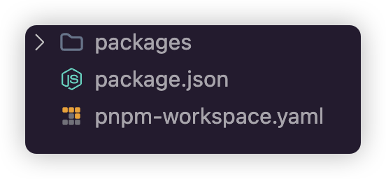
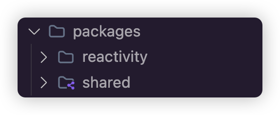
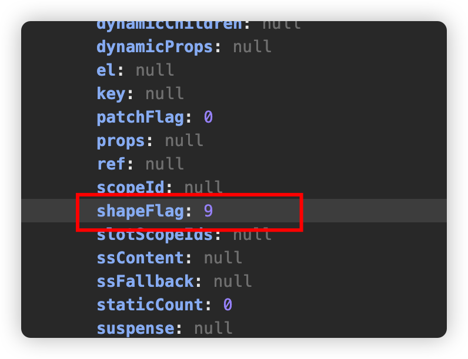

## monorepo工程基本格式



**pnpm-workspace.yaml**

指定工程管理目录

```typescript
packages:
  - "packages/**"
```

这里配置之后，我们在安装第三方包的时候，就需要指定安装参数，如果是全局安装，就需要指定-w或者--workspace-root

## 安装全局第三方包

```typescript
pnpm add rollup typescript @rollup/plugin-node-resolve @rollup/plugin-commonjs tslib rollup-plugin-typescript2 @rollup/plugin-json @types/node rollup-plugin-clear @rollup/plugin-terser rollup-plugin-generate-html-template chalk execa minimist @microsoft/api-extractor npm-run-all -D --workspace-root
```

其中:

`execa`：Execa 是一个 Node.js 库，可以替代 Node.js 的原生 child_process 模块，用于执行外部命令

`minimist`： 是一个轻量级的库，专门用于解析命令行参数和选项，使得开发者能够轻松地构建命令行工具。

`api-extractor`：是辅助打包 TypeScript 类型系统的工具，它可以将所有类型定义从一个入口获取到，最后汇总到一个`.d.ts`文件内部

## 全局tsconfig.json配置

```typescript
{
  "compilerOptions": {
    "lib":["ESNext", "DOM"],
    "target": "esnext",
    "module": "esnext",
    "moduleResolution": "node",
    "outDir": "dist",
    "esModuleInterop": true,
    "resolveJsonModule": true,
    "forceConsistentCasingInFileNames": true,
    "strict": true, 
    "skipLibCheck": true,
    "rootDir": ".", /* 指定输出文件目录(用于输出)，用于控制输出目录结构 */
    "baseUrl": ".", /* 解析非相对模块的基地址，默认是当前目录 */
    "paths": { /* 路径映射，相对于baseUrl */
      "@vue/*": ["packages/*/src"]
    }
  }
}
```

## 简单的测试子工程

在`packages`文件夹中中创建工程`reactivity`，`shared`



导入相关的简单测试代码：

### `reactivity`工程

**effect.ts**

```typescript
export function track(target:object, key:unknown) { 
  console.log(`依赖收集：${key}`);
}

export function trigger(target: object, key: unknown) { 
  console.log(`派发更新：${key}`);
}
```

**reactive.ts**

```typescript
import { track, trigger } from "./effect";

export function reactive<T extends object>(target: T): T;
export function reactive(target: object) {

  const proxy = new Proxy(target, {
    get(target, key) {
      // TODO: 收集依赖 哪个函数用到了哪个对象的哪个属性
      track(target, key);
      // 返回对象的相应属性值，推荐使用 Reflect.get
      const result = Reflect.get(target, key);
      return result;  
    },
    set(target, key, value) {
      // TODO: 触发更新
      trigger(target, key);
      // 设置对象的相应属性值，推荐使用 Reflect.set
      const result = Reflect.set(target, key, value);
      return result; 
    },
  });

  return proxy;
}
```

**index.ts**

```typescript
export { reactive } from "./reactive";
export { track, trigger } from "./effect";
```

### `shared`工程

**index.ts**

```typescript
// 自定义守卫是指通过 `{形参} is {类型}` 的语法结构，
// 来给返回布尔值的条件函数赋予类型守卫的能力
// 类型收窄只能在同一的函数中，如果在不同的函数中就不起作用。
// 如果判断val is object，下面的val.then会报错，object上没有then方法
export const isObject = (val: unknown): val is Record<any, any> => {
  return val !== null && typeof val === "object";
};

export const isArray = Array.isArray;

export const isString = (val: unknown): val is string => {
  return typeof val === "string";
};

export const isPromise = <T = any>(val: unknown): val is Promise<T> => {
  return isObject(val) && isFunction(val.then) && isFunction(val.catch);
};

export const isSymbol = (val: unknown): val is symbol =>
  typeof val === "symbol";

export const extend = Object.assign;

// 通过Object.is比较可以避免出现一些特殊情况
// 比如NaN和NaN是相等的，+0和-0是不相等的
export const hasChanged = (value: any, oldValue: any): boolean =>
  !Object.is(value, oldValue);

// 判断一个 key 是否是一个合法的整数类型的字符串
export const isIntegerKey = (key: unknown) =>
  isString(key) && // 检查 key 是否是字符串
  key !== "NaN" && // 确保 key 不是字符串 'NaN'
  key[0] !== "-" && // 确保 key 不是负数（即 key 的第一个字符不是 '-')
  "" + parseInt(key, 10) === key; // 确保 key 是一个可以被转换为整数的合法字符串

// hasOwnProperty 检查对象自身是否拥有某个属性，而不是从其原型链继承来的属性
// key is keyof typeof val 表示 key 是 val 的一个键, TS方法的谓语动词，
// 目的是为了在调用方法的时候也能够进行类型收窄。
// 因为TS的类型推断是基于值的，而不是基于变量的，
// 在调用方法的时候，TS无法推断出方法的返回值，所以我们需要使用谓语动词来告诉TS方法的返回值的类型。
const hasOwnProperty = Object.prototype.hasOwnProperty;
export const hasOwn = (
  val: object, // 第一个参数 val 是一个对象
  key: string | symbol // 第二个参数 key 是一个字符串或 symbol，表示属性的键
): key is keyof typeof val => hasOwnProperty.call(val, key);

// 判断是否为函数
export const isFunction = (val: unknown) => typeof val === "function";
// 空函数
export const NOOP = () => {};

// 以on开头的正则
const onRE = /^on[^a-z]/;
// 判断字符串是否以on开头
export const isOn = (key: string) => onRE.test(key);
```


## 两个测试子工程的package.json文件

### reactivity/package.json

```typescript
{
  "name": "@vue/reactivity",
  "version": "1.0.0",
  "description": "",
  "main": "src/index.ts", 
  "module": "dist/reactivity.esm-bundler.js",
  "types": "dist/reactivity.d.ts",
  "unpkg": "dist/reactivity.global.js",
  "jsdelivr": "dist/reactivity.global.js",
  "buildOptions": {
    "name": "VueReactivity",
    "formats": [
      "esm-bundler",
      "esm-browser",
      "cjs",
      "global"
    ]
  },
  "scripts": {
    "test": "echo \"Error: no test specified\" && exit 1"
  },
  "keywords": [],
  "author": "",
  "license": "ISC"
}
```

**注意：**main现在在测试环境下，如果打包之后可以直接指定js文件

`module`: esm文件

`types`：类型声明文件

`unpkg，jsdelivr`：浏览器可以直接引入的文件，这种文件内容一般是iife或者umd，需要指定函数返回的变量名

`buildOptions`：指定变量名和打包文件格式名

### shared/package.json

```typescript
{
  "name": "@vue/shared",
  "version": "1.0.0",
  "description": "",
  "main": "src/index.ts",
  "module": "dist/shared.esm-bundler.js",
  "types": "dist/shared.d.ts",
  "buildOptions": {
    "formats": [
      "esm-bundler",
      "cjs"
    ]
  },
  "scripts": {
    "test": "echo \"Error: no test specified\" && exit 1"
  },
  "keywords": [],
  "author": "",
  "license": "ISC"
}
```

其中，测试环境下，在main属性下，直接写的`src/index.ts`路径，我们也可以自己构造一下，比如在reactivity工程根目录下直接创建`index.js`

```typescript
'use strict'

if (process.env.NODE_ENV === 'production') {
  module.exports = require('./dist/reactivity.cjs.prod.js')
} else {
  module.exports = require('./dist/reactivity.cjs.js')
}
```

`package.json`的属性main可以改成`index.js`

shared工程同理：

```typescript
'use strict'

if (process.env.NODE_ENV === 'production') {
  module.exports = require('./dist/shared.cjs.prod.js')
} else {
  module.exports = require('./dist/shared.cjs.js')
}
```

`package.json`的属性main可以改成`index.js`

## monorepo工程引用

安装工作空间中的一个包到工作空间的另外一个包：

```typescript
pnpm add <包名B> --workspace --filter <包名A>
```

上面的命令表示将B包安装到A包里面，也就是说B包成为了A包的一个依赖。

我们这里的例子中，将shared安装到reactivity中

```typescript
pnpm add @vue/shared --workspace --filter @vue/reactivity
```

这样，就在reactivity工程包中，直接引入了工作空间的另外一个包shared，我们要引入相关内容的时候，可以如下：

```typescript
import { isArray, isIntegerKey } from "@vue/shared";
```


## 全局工程打包文件`rollup.config.mjs`

```typescript
import { createRequire } from "module";
import { fileURLToPath } from "url";
import path from "path";
import json from "@rollup/plugin-json";
import ts from "rollup-plugin-typescript2";
import terser from "@rollup/plugin-terser";

// 获取require方法
const require = createRequire(import.meta.url);
// 获取工程绝对路径
const __dirname = fileURLToPath(new URL(".", import.meta.url));
// 获取packages路径
const packagesDir = path.resolve(__dirname, "packages");
const packageDir = path.resolve(packagesDir, process.env.TARGET);

const resolve = (p) => path.resolve(packageDir, p);
// 获取package.json文件
const pkg = require(resolve(`package.json`));
// 获取package.json文件中自定义属性buildOptions
const packageOptions = pkg.buildOptions || {};
// 获取package.json文件中自定义属性buildOptions.name
const name = packageOptions.filename || path.basename(packageDir);

// 定义输出类型对应的编译项
const outputConfigs = {
  "esm-bundler": {
    file: resolve(`dist/${name}.esm-bundler.js`),
    format: `es`,
  },
  "esm-browser": {
    file: resolve(`dist/${name}.esm-browser.js`),
    format: `es`,
  },
  cjs: {
    file: resolve(`dist/${name}.cjs.js`),
    format: `cjs`,
  },
  global: {
    name: name,
    file: resolve(`dist/${name}.global.js`),
    format: `iife`,
  },
};


const defaultFormats = ["esm-bundler", "cjs"];

// 获取rollup传递过来的环境变量process.env.FORMATS
const inlineFormats = process.env.FORMATS && process.env.FORMATS.split(',');

// packageOptions.formats需要在package.json中定义
// 优先查看是否有命令行传递的参数
// 然后查看使用每个包里自定义的formats, 
// 如果没有使用defaultFormats
const packageFormats = inlineFormats || packageOptions.formats || defaultFormats 
const packageConfigs = packageFormats.map((format) =>
  createConfig(format, outputConfigs[format])
);

export default packageConfigs;

function createConfig(format, output, plugins = []) {
  // 是否输出声明文件
  const shouldEmitDeclarations = !!pkg.types;

  const isBundlerESMBuild = /esm-bundler/.test(format)
  const isBrowserESMBuild = /esm-browser/.test(format)
  const isNodeBuild = format === 'cjs'
  // 如果format包含global说明是iife导出，设置导出变量名字
  const isGlobalBuild = /global/.test(format)
  if (isGlobalBuild) {
    output.name = packageOptions.name
  }

  const minifyPlugin =
    format === "global" && format === "esm-browser" ? [terser()] : [];

  // nodejs相关的插件处理
  const nodePlugins =
    packageOptions.enableNonBrowserBranches && format !== "cjs"
      ? [
          require("@rollup/plugin-node-resolve").nodeResolve({
            extensions: [".js", "jsx", "ts", "tsx"],
            // preferBuiltins: true,
          }),
          require("@rollup/plugin-commonjs")({
            sourceMap: false,
          }),
        ]
      : [];

  // 处理ts相关插件处理
  const tsPlugin = ts({
    tsconfig: path.resolve(__dirname, "tsconfig.json"),
    tsconfigOverride: {
      compilerOptions: {
        target: format === "cjs" ? "es2019" : "es2015",
        sourceMap: true,
        declarationMap: shouldEmitDeclarations,
        declaration: shouldEmitDeclarations,
        declarationDir: "types"
      },
    },
  });

  const external =
    isGlobalBuild || isBrowserESMBuild
      ? packageOptions.enableNonBrowserBranches
        ? // externalize postcss for @vue/compiler-sfc
          // because @rollup/plugin-commonjs cannot bundle it properly
          ['postcss']
        : // normal browser builds - non-browser only imports are tree-shaken,
          // they are only listed here to suppress warnings.
          ['source-map', '@babel/parser', 'estree-walker']
      : // Node / esm-bundler builds. Externalize everything.
        [
          ...Object.keys(pkg.dependencies || {}),
          ...Object.keys(pkg.peerDependencies || {}),
          ...['path', 'url'] // for @vue/compiler-sfc
        ]

  return {
    input: resolve("src/index.ts"),
    external,
    plugins: [
      json({
        namedExports: false,
      }),
      tsPlugin,
      ...minifyPlugin,
      ...nodePlugins,
      ...plugins,
    ],
    output,
    onwarn: (msg, warn) => {
      if (!/Circular/.test(msg)) {
        warn(msg);
      }
    },
    treeshake: {
      moduleSideEffects: false,
    },
  };
}
```

## 打包编译

根目录下新建`scripts`目录，并新建`build.mjs`用于打包编译执行。由于执行的步骤较多，基本分为下面几块

- `packages`下的所有子包
- 获取到子包之后就可以执行`build`操作，借助 execa来执行`rollup`命令
- 同步编译多个包时，为了不影响编译性能，控制并发，默认并发数4
- 通过`api-extractor`实现.d.ts文件整合
- 如果不想同时编译多个包，也可以命令行自定义打包并指定其格式

### build.mjs

```typescript
import { createRequire } from "module";
import fs from "fs";
import { rm } from "fs/promises";
import path from "path";
import { execa } from "execa";
import chalk from "chalk";

// 获取require方法
const require = createRequire(import.meta.url);

// 获取packages下的所有子包
const allTargets = fs.readdirSync("packages").filter((f) => {
  // 过滤掉非目录文件
  if (!fs.statSync(`packages/${f}`).isDirectory()) {
    return false;
  }
  const pkg = require(`../packages/${f}/package.json`);
  // 过滤掉私有包和不带编译配置的包
  if (pkg.private && !pkg.buildOptions) {
    return false;
  }
  return true;
});

// 方便单独打包可以传递命令行参数
const args = require('minimist')(process.argv.slice(2))
// 如果没有传递命令行参数，就是全部工程
const targets = args._.length ? args._ : allTargets
const formats = args.formats || args.f

// 获取到子包之后就可以执行build操作，这里我们借助 execa包 来执行rollup命令
const build = async function (target) {
  const pkgDir = path.resolve(`packages/${target}`);
  const pkg = require(`${pkgDir}/package.json`);

  // 编译前移除之前生成的产物
  await rm(`${pkgDir}/dist`, { recursive: true, force: true });

  // -c 指使用配置文件 默认为rollup.config.js
  // --environment 向配置文件传递环境变量 配置文件通过process.env.获取
  await execa(
    "rollup",
    [
      "-c",
      "--environment", // 传递环境变量 
      [
        `TARGET:${target}`,
        formats ? `FORMATS:${formats}` : `` // 使用命令行参数
      ]
        .filter(Boolean).join(",")],
    { stdio: "inherit" }
  );

  // 执行完rollup生成声明文件后
  // package.json中定义此字段时执行，通过api-extractor整合.d.ts文件
  if (pkg.types) {
    console.log(
      chalk.bold(chalk.yellow(`Rolling up type definitions for ${target}...`))
    );
    // 执行API Extractor操作 重新生成声明文件
    const { Extractor, ExtractorConfig } = require("@microsoft/api-extractor");
    const extractorConfigPath = path.resolve(pkgDir, `api-extractor.json`);
    const extractorConfig =
      ExtractorConfig.loadFileAndPrepare(extractorConfigPath);
    const extractorResult = Extractor.invoke(extractorConfig, {
      localBuild: true,
      showVerboseMessages: true,
    });
    if (extractorResult.succeeded) {
      console.log(`API Extractor completed successfully`);
      process.exitCode = 0;
    } else {
      console.error(
        `API Extractor completed with ${extractorResult.errorCount} errors` +
          ` and ${extractorResult.warningCount} warnings`
      );
      process.exitCode = 1;
    }

    // 删除ts生成的声明文件
    await rm(`${pkgDir}/dist/packages`, { recursive: true, force: true });
  }
};

// 同步编译多个包时，为了不影响编译性能，我们需要控制并发的个数，这里我们暂定并发数为4
const maxConcurrency = 4; // 并发编译个数

const buildAll = async function () {
  const ret = [];
  const executing = [];
  for (const item of targets) {
    // 依次对子包执行build()操作
    const p = Promise.resolve().then(() => build(item));
    ret.push(p);

    if (maxConcurrency <= targets.length) {
      const e = p.then(() => executing.splice(executing.indexOf(e), 1));
      executing.push(e);
      if (executing.length >= maxConcurrency) {
        await Promise.race(executing);
      }
    }
  }
  return Promise.all(ret);
};
// 执行编译操作
buildAll();
```

### @microsoft/api-extractor

`@microsoft/api-extractor`这个包我们主要用来整合`.d.ts`声明文件的，你可以把这个库理解成ts声明文件处理的打包工具，最终形成的`.d.ts`由多个文件，汇总成一个文件

这里需要单独说明一下这个包的使用，本地安装`@microsoft/api-extractor`之后，可以在执行命令

```typescript
npx api-extractor init
```

在根目录生成`api-extractor`全局json配置文件，不过生成的json文件一堆注释，我们可以直接用vue的

**api-extractor.json**

```typescript
{
  "$schema": "https://developer.microsoft.com/json-schemas/api-extractor/v7/api-extractor.schema.json",

  "apiReport": {
    "enabled": true,
    "reportFolder": "<projectFolder>/temp/"
  },

  "docModel": {
    "enabled": true
  },

  "dtsRollup": {
    "enabled": true
  },

  "tsdocMetadata": {
    "enabled": false
  },

  "messages": {
    "compilerMessageReporting": {
      "default": {
        "logLevel": "warning"
      }
    },

    "extractorMessageReporting": {
      "default": {
        "logLevel": "warning",
        "addToApiReportFile": true
      },

      "ae-missing-release-tag": {
        "logLevel": "none"
      }
    },

    "tsdocMessageReporting": {
      "default": {
        "logLevel": "warning"
      },

      "tsdoc-undefined-tag": {
        "logLevel": "none"
      }
    }
  }
}
```

由于每一个子项目，都需要单独的整合，因此，在每个子项目的根目录下，创建`api-extractor.json`文件

```typescript
{
  "extends": "../../api-extractor.json",
  "mainEntryPointFilePath": "./dist/packages/<unscopedPackageName>/src/index.d.ts",
  "dtsRollup": {
    "publicTrimmedFilePath": "./dist/<unscopedPackageName>.d.ts"
  }
}
```

然后就是在`build.mjs`中的代码处理了，代码的基本原理其实就是整合生成`.d.ts`文件，然后删除原来形成的`.d.ts`文件

```typescript
const build = async function (target) {

	// 代码省略
  await execa(// 相关配置省略);

  // 执行完rollup生成声明文件后
  // package.json中定义此字段时执行，通过api-extractor整合.d.ts文件
  if (pkg.types) {
    console.log(
      chalk.bold(chalk.yellow(`Rolling up type definitions for ${target}...`))
    );
    // 执行API Extractor操作 重新生成声明文件
    const { Extractor, ExtractorConfig } = require("@microsoft/api-extractor");
    const extractorConfigPath = path.resolve(pkgDir, `api-extractor.json`);
    const extractorConfig =
      ExtractorConfig.loadFileAndPrepare(extractorConfigPath);
    const extractorResult = Extractor.invoke(extractorConfig, {
      localBuild: true,
      showVerboseMessages: true,
    });
    if (extractorResult.succeeded) {
      console.log(`API Extractor completed successfully`);
      process.exitCode = 0;
    } else {
      console.error(
        `API Extractor completed with ${extractorResult.errorCount} errors` +
          ` and ${extractorResult.warningCount} warnings`
      );
      process.exitCode = 1;
    }

    // 删除ts生成的声明文件
    await rm(`${pkgDir}/dist/packages`, { recursive: true, force: true });
  }
};
```

### 命令行自定义打包并指定其格式

这里也需要单独说明一下，主要是利用了第三方包：`minimist`，并且读取命令行参数，主要的代码如下：

```typescript
// 方便单独打包可以传递命令行参数
const args = require('minimist')(process.argv.slice(2))
// 如果没有传递命令行参数，就是全部工程
const targets = args._.length ? args._ : allTargets
const formats = args.formats || args.f
```

其中formats参数，会通过命令行命令传递进去，因此，我们可以执行命令

```typescript
 pnpm run build reactivity --formats global
```

## package.json中脚本

```typescript
"scripts": {
  "build": "node scripts/build.mjs"
},
  
// 运行
pnpm build
```


## runtime-core工程

工程的相关处理和上面reactivity和shared基本一致，就不再重复了。

由于runtime-core工程中需要用到reactivity和shared中的代码，当然需要通过Monorepo工程进行引入

```typescript
pnpm add @vue/shared @vue/reactivity --workspace --filter @vue/runtime-core
```


## 渲染器界面测试

PS: 引入渲染器之后，界面进行测试：

```typescript
<!DOCTYPE html>
<html lang="en">
  <head>
    <meta charset="UTF-8" />
    <meta name="viewport" content="width=device-width, initial-scale=1.0" />
    <title>Document</title>
  </head>
  <body>
    <div id="app"></div>
  </body>
  <script src="./runtime-core.global.js"></script>
  <script >
    const {options, createRenderer} = VueRuntimeCore;

    const oldVNode = {
      type: "div",
      children: [
        { type: "p", children: "1", key: 1 },
        { type: "p", children: "2", key: 2 },
        { type: "p", children: "3", key: 3 },
        { type: "p", children: "4", key: 4 },
        { type: "p", children: "6", key: 6 },
        { type: "p", children: "5", key: 5 },
      ],
    };

    const newVNode = {
      type: "div",
      children: [
        { type: "p", children: "1", key: 1 },
        { type: "p", children: "3", key: 3 },
        { type: "p", children: "4", key: 4 },
        { type: "p", children: "2", key: 2 },
        { type: "p", children: "7", key: 7 },
        { type: "p", children: "5", key: 5 },
      ],
    };

    const nodeOps = options;

    const renderer = createRenderer(nodeOps);
    // 首次挂载
    renderer.render(oldVNode, document.getElementById("app"));

    // 1秒后更新
    setTimeout(() => {
      renderer.render(newVNode, document.getElementById("app"));
    }, 1000);
  </script>
</html>
```

## api-extractor的问题

如果在其他的工程中导出引入工程，比如在runtime-core的工程中，导出reactivity工程的代码

```typescript
export * from "@vue/reactivity";
```

再次打包，就会提示下面的错误：

```typescript
Error: /Users/yingside/Desktop/duyi-vue/packages/shared/src/index.ts:1:1 - (ae-wrong-input-file-type) Incorrect file type; API Extractor expects to analyze compiler outputs with the .d.ts file extension. Troubleshooting tips: https://api-extractor.com/link/dts-error
```

这其实是api-extractor的问题，我们按照错误提示，屏蔽掉错误，在**全局api-extractor.json**配置中加入下面的代码即可：

```typescript
"messages": {
  "extractorMessageReporting": {
    // ... 其他配置
    "ae-wrong-input-file-type": {
      "logLevel": "none"
    }
  }
}
```

## h函数

前面我们都是自己直接创建vnode对象，其实大家知道，vue中，我们可以通过h函数创建vnode虚拟dom对象，首先将源代码中`runtime-dom`打包，看看源代码中的h函数生成的对象是什么样子的。

```typescript
<script src="./runtime-dom.global.js"></script>
<script>
const {h} = VueRuntimeDOM;

let ele1 = h("div");
let ele2 = h("div","hello div");
let ele3 = h("div",[h("img")]);

console.log(ele1);
console.log(ele2);
console.log(ele3);
</script>
```

注意打印的结果，里面有一个属性**shapeFlag**



这个属性在源代码中如下（shared目录中）：

```typescript
export const enum ShapeFlags {
  ELEMENT = 1, // 1
  FUNCTIONAL_COMPONENT = 1 << 1,// 2
  STATEFUL_COMPONENT = 1 << 2,// 4
  TEXT_CHILDREN = 1 << 3, // 8
  ARRAY_CHILDREN = 1 << 4,// 16
  SLOTS_CHILDREN = 1 << 5,// 32
  TELEPORT = 1 << 6, // 64
  SUSPENSE = 1 << 7,// 128
  COMPONENT_SHOULD_KEEP_ALIVE = 1 << 8, // 256
  COMPONENT_KEPT_ALIVE = 1 << 9, // 512
  COMPONENT = ShapeFlags.STATEFUL_COMPONENT | ShapeFlags.FUNCTIONAL_COMPONENT // 6
}
```

通过`|`**按位或运算**计算出h函数需要创建什么内容，比如

```typescript
  0001  ------------- 1
| 1000  ------------- 8
  ----
  1001  ------------- 9

  00001 ------------- 1
| 10000 ------------- 16
  -----
  10001 ------------- 17
```

在判断的时候，判断有没有包含可以用`&`**按位与**运算符，比如 9与1

```typescript
  1001  ------------- 9
& 0001  ------------- 1
  ----
  0001
```

得到结果1，这样,只要有值，可以表明组成关系，比如，如果是9与2

```typescript
  1001  ------------- 9
& 0010  ------------- 2
  ----
  0000
```

得到结果0，没有值，表明9与2没有组成关系

可以将ShapeFlags枚举放入到shared工程中，在`index.ts`中直接导出即可

```typescript
export * from "./shapeFlags";
```


接下来，首先创建`createVNode`函数，该函数的主要目的是创建虚拟节点对象vnode的基本雏形

```typescript
function createVNode(type: any, props: any, children: any) {
  const shapeFlags = isString(type) ? ShapeFlags.ELEMENT : 0;

  const vnode = {
    __v_isVnode: true, // 虚拟节点的标识
    type,
    props,
    children,
    component: null,
    el: null,
    key: props?.key,
    shapeFlags,
  };

  if (children) {
    if (Array.isArray(children)) {
      vnode.shapeFlags |= ShapeFlags.ARRAY_CHILDREN;
    } else {
      vnode.shapeFlags |= ShapeFlags.TEXT_CHILDREN;
    }
  }
  return vnode;
}
```

创建h函数

```typescript
import { ShapeFlags, isString, isObject, isArray } from "@vue/shared";

export function h(type: any, props: any, children: any) {
  // 因为h函数可以传递2个，3个甚至3个以上参数，所以我们需要根据传递的参数不一样进行判断处理
  let l = arguments.length;
  if (l === 2) {
    if (isObject(props) && !isArray(props)) {
      // 判断是不是虚拟节点
      if (isVnode(props)) {
        // 如果是虚拟节点，那么props就是children
        return createVNode(type, null, [props]);
      }
      // 如果props不是虚拟节点，那么就是props属性
      return createVNode(type, props, null);
    } else {
      // 如果是文本节点，直接挂载
      return createVNode(type, null, props);
    }
  } else {
    if (l > 3) {
      // 如果参数大于3个，除了前面的参数，后面的参数都是children，所以需要转换成数组
      children = Array.prototype.slice.call(arguments, 2);
    } else if (l === 3 && isVnode(children)) {
      // 如果参数等于3个，且children是虚拟节点
      children = [children];
    }
    return createVNode(type, props, children);
  }
}

function isVnode(value: any) {
  return value?.__v_isVnode;
}
```

当然别忘记在index.ts文件中导出h函数

重新打包之后，测试：

```typescript
<!DOCTYPE html>
<html lang="en">
  <head>
    <meta charset="UTF-8" />
    <meta name="viewport" content="width=device-width, initial-scale=1.0" />
    <title>Document</title>
  </head>
  <body>
    <div id="app"></div>
  </body>
  <script src="./runtime-core.global.js"></script>
  <script >
    const {options, createRenderer, h} = VueRuntimeCore;

    let ele1 = h("div");
    let ele2 = h("div","hello div");
    let ele3 = h("div",[h("img")]);

    console.log(ele1);
    console.log(ele2);
    console.log(ele3);

    // const oldVNode = {
    //   type: "div",
    //   children: [
    //     { type: "p", children: "1", key: 1 },
    //     { type: "p", children: "2", key: 2 },
    //     { type: "p", children: "3", key: 3 },
    //     { type: "p", children: "4", key: 4 },
    //     { type: "p", children: "6", key: 6 },
    //     { type: "p", children: "5", key: 5 },
    //   ],
    // };

    const oldVNode = h("div",[
      h("p",{key:1},"1"),
      h("p",{key:2},"2"),
      h("p",{key:3},"3"),
      h("p",{key:4},"4"),
      h("p",{key:6},"6"),
      h("p",{key:5},"5"),
    ])

    // const newVNode = {
    //   type: "div",
    //   children: [
    //     { type: "p", children: "1", key: 1 },
    //     { type: "p", children: "3", key: 3 },
    //     { type: "p", children: "4", key: 4 },
    //     { type: "p", children: "2", key: 2 },
    //     { type: "p", children: "7", key: 7 },
    //     { type: "p", children: "5", key: 5 },
    //   ],
    // };

    const newVNode = h("div",[
      h("p",{key:1},"1"),
      h("p",{key:3},"3"),
      h("p",{key:4},"4"),
      h("p",{key:2},"2"),
      h("p",{key:7},"7"),
      h("p",{key:5},"5"),
    ])

    const nodeOps = options;

    const renderer = createRenderer(nodeOps);
    // 首次挂载
    renderer.render(oldVNode, document.getElementById("app"));

    // 1秒后更新
    setTimeout(() => {
      renderer.render(newVNode, document.getElementById("app"));
    }, 1000);
  </script>
</html>

```

同时，我们之前判断节点类型的代码，其实也就可以通过`shapeFlags`来进行判断

```typescript
function patchChildren(oldVNode:VNode, newVNode:VNode, container:any) {
  const prevShapeFlag = oldVNode ? oldVNode.shapeFlags : 0
  const shapeFlag = newVNode.shapeFlags

  // 新子节点的类型是文本节点
  if (shapeFlag & ShapeFlags.TEXT_CHILDREN) {
    // 如果旧子节点是一组子节点，循环遍历并且卸载
    if (prevShapeFlag & ShapeFlags.ARRAY_CHILDREN) {
      (oldVNode.children as any).forEach((child:any) => {
        unmount(child);
      });
    }

    // 如果旧子节点是文本节点或者没有子节点，直接更新文本内容
    setElementText(container, newVNode.children as string);
  }
  // 新子节点的类型是数组，也就是一组子节点
  else if (shapeFlag & ShapeFlags.ARRAY_CHILDREN) {
    patchKeyedChildren(oldVNode, newVNode, container);
  }
  // 新子节点不存在
  else {
    // 如果运行到这里，说明新子节点不存在
    // 如果旧子节点是一组子节点，循环遍历并且卸载
    if (prevShapeFlag & ShapeFlags.ARRAY_CHILDREN) {
      (oldVNode.children as any).forEach((child:any) => {
        unmount(child);
      });
    }
    // 如果旧子节点是文本节点,直接清空
    else if (prevShapeFlag & ShapeFlags.TEXT_CHILDREN) {
      setElementText(container, "");
    }
  }
}
```

## 组件的基本实现原理

我们其实知道，组件就是一个对象，一个最基本的组件，类似于下面的形式

```typescript
const MyComponent = {
  name: 'MyComponent',
  data(){
    return {
      foo:'hello world'
    }
  },
  render(){
    return {
      type:'div',
      children: '我是文本内容'
    }
  }
}
```

我们知道，`data()`函数中其实就是响应式数据，`render()`函数就是组件要渲染的内容。

当然这只是组件对象，我们还需要虚拟DOM进行调用：

```typescript
const CompVNode = {
  type: MyComponent
}
```

可以看到，我们现在的虚拟DOM，`type`就是**组件对象**，也就是现在我们需要挂载组件的时候，根据对象类型去进行处理

根据这个形式，其实我们就能写出相关组件的处理代码：

```typescript
export function createRenderer<
  HostNode = any,
  HostElement = any
  >(options: RendererOptions<HostNode, HostElement>) {
	//其他省略......
  function patch(oldVNode: any, newVNode:any, container:any, anchor = null) {
    // 其他省略
    else if (typeof type === "object") {
      if (!oldVNode) {
        // 挂载组件
        mountComponent(newVNode, container, anchor);
      }
      else { 
        // 更新组件
      }
    }
  }
  
	function mountComponent(vnode:any, container:any, anchor:any) {
    // 通过vnode获取组件的选项对象
    const componentOptions = vnode.type;
    // 获取组件的渲染函数
    const { render } = componentOptions;
    // 执行渲染函数，获取要渲染的内容，其实也就是函数返回的虚拟DOM对象
    const subTree = render();
    // 挂载
    patch(null, subTree, container, anchor);
  }
}

```

这样，其实就和之前挂载虚拟DOM没有什么区别了

```typescript
<body>
  <div id="app"></div>
</body>
<script src="../dist/runtime-core.global.js"></script>
<script>
  const {render,h} = VueRuntimeCore
  const MyComponent = {
    name: 'MyComponent',
    data(){
      return {
        foo:'hello world'
      }
    },
    render(){
      return {
        type:'div',
        children: '我是文本内容'
      }
    }
  }

  // 虚拟DOM
  // const CompVNode = {
  //   type: MyComponent
  // }
  render(h(MyComponent),document.getElementById('app'))
</script>
```

上面导出的render函数，是将之前的createRenderer函数稍微封装了一下

```typescript
function ensureRenderer() { 
  return createRenderer(options);
}

export const render = ensureRenderer().render;
```

在`index.ts`中，导出`render`函数即可

当然，这只是渲染函数，如果我希望使用数据，并且还希望是响应式数据，比如在调用的使用写成下面的样子

```typescript
const MyComponent = {
  name: 'MyComponent',
  data(){
    return {
      foo:'hello world'
    }
  },
  render(){
    return {
      type:'div',
      children: '我是文本内容--->' + this.foo
    }
  }
}
```

那我们就需要对`data()`函数再进行处理

```typescript
function mountComponent(vnode:any, container:any, anchor:any) {
  // 通过vnode获取组件的选项对象
  const componentOptions = vnode.type;
  // 获取组件的渲染函数
  const { render, data } = componentOptions;

  // 调用data获取原始数据，并用reactive进行响应式处理
  const state = reactive(data());

  // 调用render函数时，将this设置为state
  // 这样在render函数中就可以通过this访问到state
  const subTree = render.call(state, state);
  // 挂载
  patch(null, subTree, container, anchor);
}
```

上面的代码主要是两个步骤：

- 通过组件对象获取data()函数并执行，然后调用reactive函数将data()函数返回的状态包装为响应式数据
- 在调用render函数的时候，将其this的指向设置为响应式数据state，同时将state作为render函数的第一个参数传递

这样，就实现了对组件自身状态的支持，而且我们还能在渲染函数内访问组件自身的状态。

当然，当组件发生变化的时候需要更新，其实我们只需要将渲染任务包装到effect函数中就可以了。

```typescript
function mountComponent(vnode:any, container:any, anchor:any) {
  // 通过vnode获取组件的选项对象
  const componentOptions = vnode.type;
  // 获取组件的渲染函数
  const { render, data } = componentOptions;

  // 调用data获取原始数据，并用reactive进行响应式处理
  const state = reactive(data());

  // 将render函数包装到effect函数中
  effect(() => { 
    // 调用render函数时，将this设置为state
    // 这样在render函数中就可以通过this访问到state
    const subTree = render.call(state, state);
    // 挂载
    patch(null, subTree, container, anchor);
  })
}
```

这样，一旦组件自身的响应式数据发生变化，组件就会自动的重新执行渲染函数(当然现在仅仅只能重新再进行挂载)。

不过这里要注意一个问题，effect的执行是同步的，因此当响应式数据发生变化的时候，与之关联的副作用函数就会同步执行。也就是说，如果多次修改响应式数据的值，就会导致渲染函数执行多次，这实际上是没有必要的。我们需要的是无论响应式数据短时间内修改多少次，副作用函数只会重新执行一次就行了。

这个其实我们之前在讲调度器的时候已经实现了，现在我们拿过来，稍微修改一下就可以了。

其实基本原理就是当副作用函数需要重新执行的时候，我们不会立即执行，而是将其缓冲到一个微任务队列中，等到执行栈清空之后，再将它从微任务队列中取出来执行。

```typescript
function mountComponent(vnode:any, container:any, anchor:any) {
  // 通过vnode获取组件的选项对象
  const componentOptions = vnode.type;
  // 获取组件的渲染函数
  const { render, data } = componentOptions;

  // 调用data获取原始数据，并用reactive进行响应式处理
  const state = reactive(data());

  // 将render函数包装到effect函数中
  effect(() => { 
    // 调用render函数时，将this设置为state
    // 这样在render函数中就可以通过this访问到state
    const subTree = render.call(state, state);
    // 挂载
    patch(null, subTree, container, anchor);
  }, {
    scheduler: queueJob
  })
}


// 自定义调度器
let isFlushing = false;
// 用set集合来存储副作用函数，使用Set是因为Set不允许有重复的值，
// 这样可以保证同一个副作用函数不会重复被添加到队列中
const queue = new Set();

const p = Promise.resolve();

function queueJob(job:any) {
  queue.add(job);
  if (!isFlushing) { 
    // 设置为true，避免重复刷新
    isFlushing = true;

    p.then(() => { 
      queue.forEach((job:any) => job());
    })
    .finally(() => { 
      isFlushing = false;
      queue.clear();
    })
  }
}
```

界面测试：

```typescript
<!DOCTYPE html>
<html lang="en">
<head>
  <meta charset="UTF-8">
  <meta name="viewport" content="width=device-width, initial-scale=1.0">
  <title>Document</title>
</head>
<body>
  <div id="app"></div>
</body>
<script src="../dist/runtime-core.global.js"></script>
<script>
  const {render,h} = VueRuntimeCore

  // const MyComponent = {
  //   name: 'MyComponent',
  //   data(){
  //     return {
  //       foo:'hello world'
  //     }
  //   },
  //   render(){
  //     return {
  //       type:'div',
  //       children: [
  //         {
  //           type:'span',
  //           children: '我是文本内容--->' + this.foo
  //         },
  //         {
  //           type:'button',
  //           props:{
  //             onClick:()=>{
  //               console.log('click')
  //               this.foo = 'hello vue'
  //             }
  //           },
  //           children: '按钮'
  //         }
  //       ]
  //     }
  //   }
  // }

	const MyComponent = {
    name: 'MyComponent',
    data(){
      return {
        foo:'hello world'
      }
    },
    render(){
      return h("div",{},[
        h("span",{},'我是文本内容--->' + this.foo),
        h("button",{
          onClick:()=>{
            console.log('click')
            this.foo = 'hello vue'
          }
        },'按钮')
      ])
    }
  }

  render(h(MyComponent),document.getElementById('app'))
</script>
</html>
```

当然，我们现在每次重新渲染的patch函数，第一个参数都是null，也就是每次都在重新挂载，这肯定是不完整的，完整的应该是，每次更新的时候，都拿新的subTree与上一次组件所渲染的subTree进行更新。

为此，我们最好实现一个组件实例，用它来维护组件的整个生命周期状态。这样渲染器才能在正确的时机执行合适的操作。
