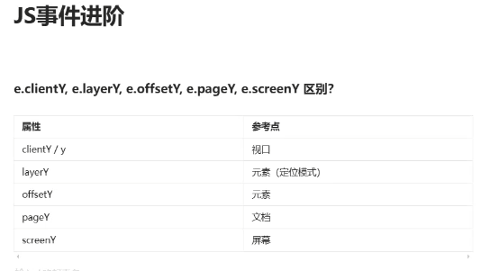
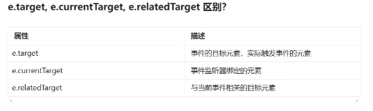
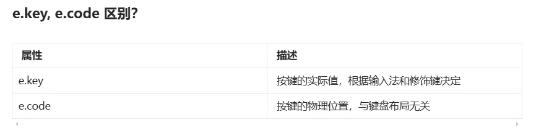

![https://mfe.duyiedu.com/p/course/ecourse/course_2jj678vp4xHnPiB6c7sd9YwQMb8]
## 执行上下文

### 定义
> 执行上下文是js 代码执行时创建的一个环境，里面包含JS代码执行所需要的所有信息

### 分类
1. 全局执行上下文
2. 函数执行上下文
3. eval执行上下文

> 执行上下文是以栈的形式来管理的，栈底层始终是全局执行上下文，
> 之后只要调用函数就会有一个执行上下文入栈
### 执行上下文组成部分
 1. this的绑定：确定this的指向
 2. 词法环境：包含变量环境和外部环境引用
 3. 变量环境：用来存储变量的声明
 4. 私有环境：用于存储class中的私有变量

 ### 词法环境和变量环境有什么区别
  **词法环境**
  > 作用域是一个概念，描述了变量和函数的可访问范围。
  > 词法环境是实现作用域的具体机制，是 JavaScript 引擎内部的数据结构
  
  1. 环境记录： let const 函数声明 class声明 arguments对象等
    1. 声明性环境记录： let const 函数声明 class声明 arguments对象等都是属性声明性环境记录
    2. 对象性环境记录： 对象字面量，with语句等都是对象性环境记录
  2. 外部词法环境： 指向外部的词法环境，从而形成作用域链

  **变量环境**：词法环境的一种特殊类型，概念上和词法环境分开，但是从数据结构上看，变量环境和词法环境是相同的，差别仅仅提现在用途上，变量环境用于存储使用var声明的关键字，


## 原型和原型链

> 生成对象的两种方式
> 1. 通过类实例化出来一个对象: 对象信息来自于类的构造器以及构造器的参数
> 2. 通过原型对象创建一个对象： 对象信息来自于原型对象
**注意：Es6 提供的class，是否将JS 改造为基于类创建对象？**
> 不是，class只是语法糖，本质上还是基于原型链来创建对象

**class 与构造函数的区别**
> 1. 构造函数可以当成普通函数调用，class不能
> 2. class 在进行枚举的时候，原型上的属性不会被枚举出来，构造函数可以
> 3. class 内部代码默认是严格模式，构造函数不是。**ES6的模块默认严格模式**
> 4. class 里面的方法是无法去new的，构造函数可以

### 原型链继承
**组合继承模式**
```js
// 父类
function Parent(value) {
  this.val = value
}
Parent.prototype.getValue = function() {
  console.log(this.val)
}

// 子类
function Child(value) {
  // 继承属性
  Parent.call(this, value)
}
// 继承方法
Child.prototype = new Parent()

```
**缺点**
> 实例对象上面会有一份属性，原型对象上面也会有一份属性，从而造成内存空间浪费

### 圣杯继承
**工厂函数**
```js
function inherit(Child, Parent) {
  function F() {}
  F.prototype = Parent.prototype
  Child.prototype = new F()
  Child.prototype.constructor = Child
}
```
**缺点**
> 1. 代码不够优雅
> 2. 代码不够语义化

**现在如何写继承**
> ES6 提供了class，通过extends关键字来实现继承

## JS 事件


