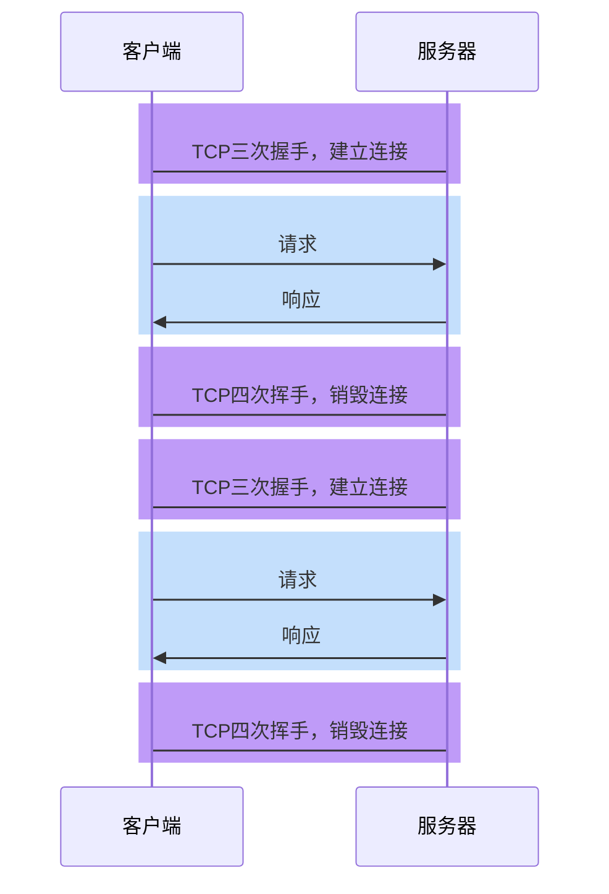
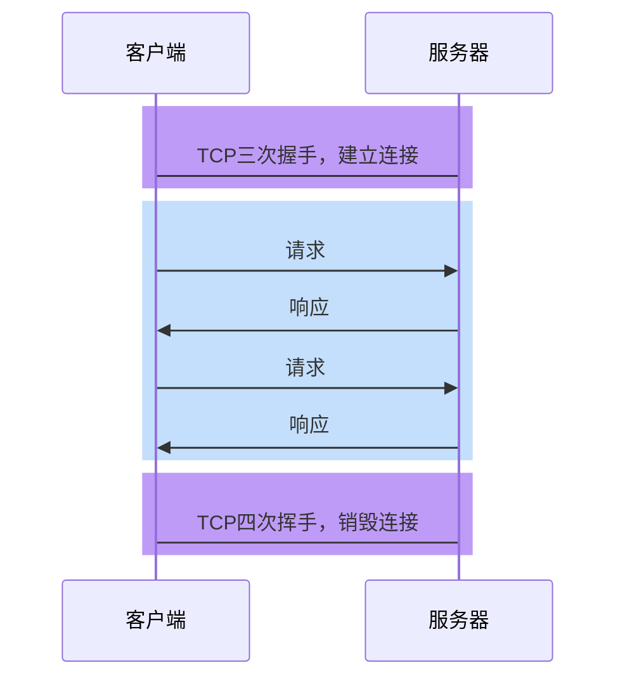

1. 介绍下重绘和重排（repaint & reflow），以及如何进行优化

   > 参考答案：
   >
   > 整个页面可以看做是一幅画，这幅画是由浏览器绘制出来的，浏览器绘制这幅画的过程称之为渲染。
   >
   > 渲染是一件复杂的工作，它大致分为以下几个过程：
   >
   > 1. 解析 HTML，生成 DOM 树，解析 CSS，生成样式规则树
   > 2. 将 DOM 树和样式规则树结合，生成渲染树(Render Tree)
   > 3. 根据生成的渲染树，确定元素的布局信息（元素的尺寸、位置），**这一步称之为 reflow，译作重排或回流**
   > 4. 根据渲染树和布局信息，生成元素的像素信息（元素横纵的像素点，左上角的偏移量、每个像素的颜色等）。**这一步称之为 repaint，译作重绘**
   > 5. 将像素信息提交到 GPU 完成屏幕绘制
   >
   > 当元素的布局信息发生变化时，会导致重排。
   >
   > 当元素的像素信息发生变化时，会导致重绘。
   >
   > 重排一定会导致重绘，因此布局信息的变化一定会导致像素信息的变化。
   >
   > 在实际开发中，获取和设置元素尺寸、位置均会导致重排和重绘，而仅设置元素的外观（比如背景颜色）则只会导致重绘，不会导致重排。
   >
   > 重排是一项繁琐的工作，会降低效率，因此在开发中，应该尽量避免直接获取和设置元素的尺寸、位置，尽量使用变量来保存元素的布局信息。
   
2. 说说浏览器和 Node 事件循环的区别

   > 参考答案：
   >
   > 浏览器的事件循环比较简单，它把任务分为宏任务和微任务，当执行栈清空后，会优先调取微任务运行，当微任务队列清空后，才会调取宏任务运行。
   >
   > 而 node 的事件循环机制比较复杂，它将整个任务调度分为 6 个阶段，当执行栈清空后，将依次循环 6 个阶段：
   >
   > 1. timers
   > 2. pending callbacks
   > 3. idle, prepare
   > 4. poll
   > 5. check
   > 6. close callback
   >
   > 在进入任何一个阶段时，都将检查微队列中是否有任务需要执行，只有微队列清空后才能顺利进入下一个阶段。
   
3. 浏览器缓存读取规则

   > 参考答案：
   >
   > 当需要获取一个资源时，浏览器会先检查缓存中是否存在，若命中缓存，则不会发送请求。浏览器按照一定的顺序检查缓存，具体顺序是：
   >
   > 1. service worker
   >
   >    在 service worker 中，开发者可以根据需要将远程获取的资源缓存到 cache storage 中，之后对该资源的请求会直接从缓存中获取。
   >
   >    这部分缓存需要前端开发者手动完成的
   >
   > 2. memory cache
   >
   >    浏览器会自动将请求过的资源自动加入到 memory cache，这主要是为了解决一个页面中有多次相同的请求，比如页面中链接了多张相同的图片。
   >
   >    memory cache 是浏览器自动完成的，它保存在内存中。
   >
   > 3. disk cache
   >
   >    当浏览器得到的响应头中包含`cache-control`等缓存指令时，会按照指令的要求设置 disk cache。请求的资源会被保存在磁盘中，在指定的期限内有效。
   >
   >    disk cache 是长期的，即使关闭浏览器也不会消失。
   
4. 为什么通常在发送数据埋点请求的时候使用的是 1x1 像素的透明 gif 图片？

   > 参考答案：
   >
   > 首先，在很多场景中，处理埋点的服务器很有可能是第三方服务器，比如百度的站点统计埋点，百度就是一个第三方服务器，这就不可避免的带来跨域问题。
   >
   > 其次，埋点服务方需要提供一种特别利于安装的埋点置入代码，使用传统的 ajax 会使代码变得臃肿。
   >
   > 同时，埋点请求绝大部分都是 get 请求，又无须得到服务器的响应结果。
   >
   > 基于以上的特点，使用 img 元素请求服务器就变得理所当然了，img 元素发出的请求天生支持跨域，书写的代码简单，只需要创建一个 img 元素，然后设置 src 为埋点请求地址即可。
   >
   > 其实请求一旦发出，埋点就成功了，无须得到服务器的响应结果。但如果服务器不给予任何响应的话，可能会导致浏览器端控制台报错，尽管这个报错并不影响实质的功能。为了避免这种情况，服务器于是响应一个最小体积的图片即可，而 1x1 像素的透明 gif 图片是体积最小的图片，自然就选用了它作为响应结果。
   
5. 请求时浏览器缓存 from memory cache 和 from disk cache 的依据是什么，哪些数据什么时候存放在 Memory Cache 和 Disk Cache 中？

   > 参考答案：
   >
   > memory cache 是浏览器自动完成的，它不关心 http 语义，但会遵守`cache-control: no-store`指令。浏览器在请求资源后，会自动将资源加入 memory cache，在后续的请求中，若请求的 url 地址和之前缓存的对应地址相同，则直接使用 memory cache。memory cache 只缓存 get 请求，并且缓存的内容在内存中，因此会很快的清理。
   >
   > disk cache 遵守 http 缓存语义，它会按照服务器响应头中指定的缓存要求进行缓存，由于它存在于磁盘中，因此，即便浏览器关闭后缓存内容也不会消失。它的保存时间由服务器的`cache-control`字段指定，当缓存失效后，会重新发送请求到服务器，进入协商缓存的流程。
   
6. 什么是浏览器同源策略？

   > 参考答案：
   >
   > 所谓同源，是指协议、主机、端口均相同的地址。
   >
   > 同源策略是指，当前页面和页面运行过程中发出的请求必须是同源的，即必须协议、主机、端口均相同，否则即被视为跨域请求。
   >
   > 浏览器中的大部分内容都是受同源策略限制的，但是以下三个标签可以不受限制：
   >
   > - img
   > - script
   > - link

7. DOM Tree 是如何构建的？

   > 参考答案：
   >
   > 1. 转码: 浏览器将接收到的二进制数据按照指定编码格式转化为 HTML 字符串
   > 2. 生成 Tokens: 之后开始 parser，浏览器会将 HTML 字符串解析成 Tokens
   > 3. 构建 Nodes: 对 Node 添加特定的属性，通过指针确定 Node 的父、子、兄弟关系和所属 treeScope
   > 4. 生成 DOM Tree: 通过 node 包含的指针确定的关系构建出 DOM Tree
   
8. 浏览器如何解析 css 选择器？

   > 参考答案：
   >
   > 浏览器读取到选择器时，会从 DOM 树中找到匹配的对应节点，然后将样式附着到对应的 DOM 元素上。当选择器出现多个层级时，浏览器会使用「从右到左」的顺序进行匹配，对应到 DOM 树的遍历上，是从叶子到根的方向进行筛选，这样可以提升匹配效率。
   
9. 浏览器是如何渲染 UI 的？

   > 参考答案：
   >
   > 1. 浏览器解析 HTML，形成 DOM Tree
   > 2. 解析 HTML 过程中遇到 CSS，则进行 CSS 解析，生成 Style Rules
   > 3. 将 DOM Tree 与 Style Rules 合成为 Render Tree
   > 4. 进入布局（Layout）阶段，为每个节点分配一个应出现在屏幕上的确切坐标
   > 5. 随后调用 GPU 进行绘制（Paint），遍历 Render Tree 的节点，并将元素呈现出来
   
10. 浏览器的主要组成部分是什么？

    > 参考答案：
    >
    > 1. 用户界面（user interface）
    >
    >    用于呈现浏览器窗口部件，比如地址栏、前进后退按钮、书签、顶部菜单等
    >
    > 2. 浏览器引擎（browser engine）
    >
    >    用户在用户界面和渲染引擎中传递指令
    >
    > 3. 渲染引擎（rendering engine）
    >
    >    负责解析 HTML、CSS，并将解析的内容显示到屏幕上。我们平时说的浏览器内核就是指这部分。
    >
    > 4. 网络（networking）
    >
    >    用户网络调用，比如发送 http 请求
    >
    > 5. 用户界面后端（UI backend）
    >
    >    用于绘制基本的窗口小部件，比如下拉列表、文本框、按钮等，向上提供公开的接口，向下调用操作系统的用户界面。
    >
    > 6. JS 解释器（JavaScript interpreter）
    >
    >    解释执行 JS 代码。我们平时说的 JS 引擎就是指这部分。
    >
    > 7. 数据存储（data storage）
    >
    >    用户保存数据到磁盘中。比如 cookie、localstorage 等都是使用的这部分功能。
    
11. 常见的浏览器内核有哪些?

    > 参考答案：
    >
    > | 浏览器    | 内核（渲染引擎）         | JavaScript 引擎 |
    > | --------- | ------------------------ | --------------- |
    > | Chrome    | Blink（新） Webkit（旧） | V8              |
    > | FireFox   | Gecko                    | SpiderMonkey    |
    > | Safari    | Webkit                   | JavaScriptCore  |
    > | Edge      | EdgeHTML                 | Chakra          |
    > | IE        | Trident                  | Chakra          |
    > | PhantomJS | Webkit                   | JavaScriptCore  |
    > | Node.js   | 无                       | V8              |

12. 怎样选择合适的缓存策略

    > 参考答案：
    >
    > 1. 对于一次性的资源，比如验证码图片，不进行缓存。
    >
    >    设置响应头`cache-control: no-store`
    >
    > 2. 对于频繁变动的资源，比如某些数据接口，使用协商缓存。
    >
    >    设置响应头`cache-control: no-cache`，同时配合`ETag`标记，让浏览器缓存资源，但每次都会发送请求询问资源是否更新。
    >
    > 3. 对于静态资源，比如 JS、CSS、图片等文件，使用强制缓存。
    >
    >    设置响应头`cache-control: max-age=有效时长`，设置一个很长的过期时间，比如十年，然后通过文件 hash 的处理更新
    
13. 为什么用多个域名存储网站资源更有效？

    > 参考答案：
    >
    > 主要原因是浏览器对同一个域下的 TCP 连接数是有限制的，这样就导致某个网页如果外部资源多了，比如图片很多的网页，在解析页面时，由于 TCP 连接数受限，就无法同时发起多个下载连接，无法充分利用带宽资源。因此，可以把静态资源放到多个域名下，这样就绕开了连接数的限制，做到了并发下载。
    
14. 前端需要注意哪些 SEO

    > 参考答案：
    >
    > 1. 语义化
    >
    >    多使用语义化标签，让正确的标签对应正确的内容。
    >
    > 2. 重要内容前置
    >
    >    可以利用弹性盒布局中的 order 属性，将核心、重要的内容尽量放到文档的前面。
    >
    > 3. 服务端渲染
    >
    >    由于目前的搜索引擎对客户端渲染并不友好，因此使用服务端渲染仍然是 SEO 的重要手段。
    >
    > 4. TDK
    >
    >    利用 title、meta 元素，设置网页的标题、描述、关键字
    
15. 浏览器是怎么对 HTML5 的离线储存资源进行管理和加载的呢

    > 参考答案：
    >
    > 在线的情况下，浏览器发现 html 头部有 manifest 属性，它会请求 manifest 文件，如果是第一次访问 app，那么浏览器就会根据 manifest 文件的内容下载相应的资源并且进行离线存储。如果已经访问过 app 并且资源已经离线存储了，那么浏览器就会使用离线的资源加载页面，然后浏览器会对比新的 manifest 文件与旧的 manifest 文件，如果文件没有发生改变，就不做任何操作，如果文件改变了，那么就会重新下载文件中的资源并进行离线存储。
    > 离线的情况下，浏览器就直接使用离线存储的资源。


16. 如何兼容低版本浏览器

> 参考答案：
>
> 分为三个部分来说
>
> HTML
>
> 低版本浏览器无法识别新增的HTML5元素，如果要兼容这部分浏览器，需要做以下处理：
>
> 1. 对于非可替换元素，比如article、section、header、footer等，这种元素虽然低版本浏览器不识别，但它仍然会把它们渲染出来，只是没有浏览器的默认样式。因此，我们只需要在css中稍作处理即可，比如给它们都加上`display:block`。
> 2. 对于可替换元素，比如video、audio等，这种元素会涉及低版本浏览器没有功能，因此需要使用条件注释，在低版本浏览器中使用兼容的做法
>
> CSS
>
> 对于CSS代码，低版本浏览器可能无法识别某些CSS属性，比如圆角边框、背景渐变、过渡动画等。但由于浏览器对于不能识别样式的处理方式是「直接丢弃、不影响后续渲染」，所以，我们可以保持这样的原则：尽量让其兼容，实在不行，至少不影响浏览。按照这样的原则，我们可以对CSS进行以下处理：
>
> 1. 使用厂商前缀，尽量让其兼容。
> 2. 对于某些样式使用JS替代，比如渐变、动画等
>
> JavaScript
>
> 对于JS代码，低版本浏览器无法识别H5的API，因此缺少了一些新功能，比如localstorage、web worker等。不仅如此，低版本浏览器还无法识别ES6的新语法，比如let、const、async、await等。因此，要处理JS的兼容性问题，只能具体情况具体分析，通常，我们会使用下面两种手段来完成兼容：
>
> 1. 模拟API。就是自己写一个功能完全和官方相同的API，来弥补低版本浏览器API没有的情况。比较典型的就是ES5中有大量的数组API，这些API都是可以轻松模拟的。
> 2. 编译。某些新语法是无法模拟的，只能通过制作工具对源代码进行编译，将其新语法全部去掉，如果新语法涉及特殊功能，则转换为使用API完成，比较典型的例子就是async和await会被转换为generator的函数调用。
>
> 在前端工程化的今天，上面的几乎所有兼容性问题都可以依靠工程化完成，比如，css可以依托postcss平台完成兼容性处理，JS可以依托babel平台完成兼容性处理。


17. 浏览器怪异模式和普通模式的区别

> 参考答案：
>
> 标准模式：浏览器按W3C标准解析执行代码
>
> 怪异模式：使用浏览器自己的方式解析执行代码，因为不同浏览器解析执行的方式不一样，所以称之为怪异模式。比如IE中盒模型的宽高使用的是边框盒。


18. 各个浏览器兼容前缀？

> 参考答案：
>
> | 前缀     | 浏览器         |
> | -------- | -------------- |
> | -moz-    | firefox        |
> | -webkit- | chrome、safari |
> | -o-      | opera          |
> | -ms-     | IE             |


19. 跨标签页的通讯方式有哪些（哔哩哔哩）

> 参考答案：
>
> - BroadCast Channel
> - Service Worker
> - LocalStorage window.onstorage 监听
> - Shared Worker 定时器轮询(setInterval)
> - IndexedDB 定时器轮询(setInterval)
> - cookie 定时器轮询(setInterval)
> - window.open window.postMessage
> - Websocket
# HTTP1.0

## 无法复用连接

HTTP1.0为每个请求单独新开一个TCP连接



由于每个请求都是独立的连接，因此会带来下面的问题：

1. 连接的建立和销毁都会占用服务器和客户端的资源，造成内存资源的浪费

2. 连接的建立和销毁都会消耗时间，造成响应时间的浪费

3. 无法充分利用带宽，造成带宽资源的浪费

   > TCP协议的特点是「慢启动」，即一开始传输的数据量少，一段时间之后达到传输的峰值。而上面这种做法，会导致大量的请求在TCP达到传输峰值前就被销毁了

## 队头阻塞


# HTTP1.1

## 长连接

为了解决HTTP1.0的问题，**HTTP1.1默认开启长连接**，即让同一个TCP连接服务于多个请求-响应。



在这种情况下，多次请求响应可以共享同一个TCP连接，这不仅减少了TCP的握手和挥手时间，同时可以充分利用TCP「慢启动」的特点，有效的利用带宽。

> 实际上，在HTTP1.0后期，虽然没有官方标准，但开发者们慢慢形成了一个共识：
>
> **只要请求头中包含Connection:keep-alive，就表示客户端希望开启长连接，希望服务器响应后不要关闭TCP连接。如果服务器认可这一行为，即可保持TCP连接。**

当需要的时候，任何一方都可以关闭TCP连接

> 扩展知识
>
> 连接关闭的情况主要有三种：
>
> 1. 客户端在某一次请求中设置了`Connection:close`，服务器收到此请求后，响应结束立即关闭TCP
> 2. 在没有请求时，客户端会不断对服务器进行心跳检测（一般每隔1秒）。一旦心跳检测停止，服务器立即关闭TCP
> 3. 当客户端长时间没有新的请求到达服务器，服务器会主动关闭TCP。运维人员可以设置该时间。

由于一个TCP连接可以承载多次请求响应，并在一段时间内不会断开，因此这种连接称之为长连接。

## 管道化和队头阻塞

HTTP1.1允许在响应到达之前发送下一个请求，这样可以大幅缩减带宽限制时间

**但这样做会存在队头阻塞的问题**


由于多个请求使用的是同一个TCP连接，**服务器必须按照请求到达的顺序进行响应**

> 想一想为什么？

于是，导致了一些后发出的请求，无法在处理完成后响应，产生了等待的时间，而这段时间的带宽可能是空闲的，这就造成了带宽的浪费

队头阻塞虽然**发生在服务器**，但这个问题的根源是客户端无法知晓服务器的响应是针对哪个请求的。

正是由于存在队头阻塞，我们常常使用下面的手段进行优化：

- 通过减少文件数量，从而减少队头阻塞的几率

- 通过开辟多个TCP连接，实现真正的、有缺陷的并行传输

  > 浏览器会根据情况，为打开的页面自动开启TCP连接，对于同一个域名的连接最多6个
  >
  > 如果要突破这个限制，就需要把资源放到不同的域中

**然而，管道化并非一个成功的模型，它带来的队头阻塞造成非常多的问题，所以现代浏览器默认是关闭这种模式的**

# HTTP2.0


## 二进制分帧

HTTP2.0可以允许以更小的单元传输数据，每个传输单元称之为**帧**，而每一个请求或响应的完整数据称之为**流**，每个流有自己的编号，每个帧会记录所属的流。

比如，服务器连续接到了客户端的两个请求，一个请求JS、一个请求CSS，两个文件如下：

```js
function a(){}
function b(){}
```

```css
.container{}
.list{}
```

最终形成的帧可能如下


可以看出，每个帧都带了一个头部，记录了流的ID，这样做就能够准确的知道这一帧数据是属于哪个流的。


这样就真正的解决了共享TCP连接时的队头阻塞问题，实现了真正的**多路复用**

不仅如此，由于传输时是以帧为单元传输的，无论是响应还是请求，都可以实现并发处理，即不同的传输可以交替进行。

由于进行了分帧，还可以设置传输优先级。

## 头部压缩

HTTP2.0之前，所有的消息头都是以字符的形式完整传输的

可实际上，大部分头部信息都有很多的重复

为了解决这一问题，HTTP2.0使用头部压缩来减少消息头的体积


对于两张表都没有的头部，则使用Huffman编码压缩后进行传输，同时添加到动态表中

## 服务器推

HTTP2.0允许在客户端没有主动请求的情况下，服务器预先把资源推送给客户端

当客户端后续需要请求该资源时，则自动从之前推送的资源中寻找

# 面试题

1. 介绍下 `http1.0`、`http1.1`、`http2.0` 协议的区别？

   > 参考答案：
   >
   > 首先说 http1.0
   >
   > 它的特点是每次请求和响应完毕后都会销毁 TCP 连接，同时规定前一个响应完成后才能发送下一个请求。这样做有两个问题：
   >
   > 1. 无法复用连接
   >
   >    每次请求都要创建新的 TCP 连接，完成三次握手和四次挥手，网络利用率低
   >
   > 2. 队头阻塞
   >
   >    如果前一个请求被某种原因阻塞了，会导致后续请求无法发送。
   >
   > 然后是 http1.1
   >
   > http1.1 是 http1.0 的改进版，它做出了以下改进：
   >
   > 1. 长连接
   >
   >    http1.1 允许在请求时增加请求头`connection:keep-alive`，这样便允许后续的客户端请求在一段时间内复用之前的 TCP 连接
   >
   > 2. 管道化
   >
   >    基于长连接的基础，管道化可以不等第一个请求响应继续发送后面的请求，但响应的顺序还是按照请求的顺序返回。
   >
   > 3. 缓存处理
   >
   >    新增响应头 cache-control，用于实现客户端缓存。
   >
   > 4. 断点传输
   >
   >    在上传/下载资源时，如果资源过大，将其分割为多个部分，分别上传/下载，如果遇到网络故障，可以从已经上传/下载好的地方继续请求，不用从头开始，提高效率
   >
   > 最后是 http2.0
   >
   > http2.0 进一步优化了传输效率，它主要有以下改进：
   >
   > 1. 二进制分帧
   >
   >    将传输的消息分为更小的二进制帧，每帧有自己的标识序号，即便被随意打乱也能在另一端正确组装
   >
   > 2. 多路复用
   >
   >    基于二进制分帧，在同一域名下所有访问都是从同一个 tcp 连接中走，并且不再有队头阻塞问题，也无须遵守响应顺序
   >
   > 3. 头部压缩
   >
   >    http2.0 通过字典的形式，将头部中的常见信息替换为更少的字符，极大的减少了头部的数据量，从而实现更小的传输量
   >
   > 4. 服务器推
   >
   >    http2.0 允许服务器直接推送消息给客户端，无须客户端明确的请求
   
2. 为什么 HTTP1.1 不能实现多路复用（腾讯）

   > 参考答案：
   >
   > HTTP/1.1 的传输单元是整个响应文本，因此接收方必须按序接收完所有的内容后才能接收下一个传输单元，否则就会造成混乱。而HTTP2.0的传输单元更小，是一个二进制帧，而且每个帧有针对所属流的编号，这样即便是不同的流交替传输，也可以很容易区分出每个帧是属于哪个流的。

3. 简单讲解一下 http2 的多路复用（网易）

   > 在 HTTP/2 中，有两个非常重要的概念，分别是帧（frame）和流（stream）。 帧代表着最小的数据单位，每个帧会标识出该帧属于哪个流，流也就是多个帧组成的数据流。 多路复用，就是在一个 TCP 连接中可以存在多条流。换句话说，也就是可以发送多个请求，对端可以通过帧中的标识知道属于哪个请求。通过这个技术，可以避免 HTTP 旧版本中的队头阻塞问题，极大的提高传输性能。

4. http1.1 是如何复用 tcp 连接的？（网易）

   > 客户端请求服务器时，通过请求行告诉服务器使用的协议是 http1.1，同时在请求头中附带`connection:keep-alive`（为保持兼容），告诉服务器这是一个长连接，后续请求可以重复使用这一次的 TCP 连接。
   >
   > 这样做的好处是减少了三次握手和四次挥手的次数，一定程度上提升了网络利用率。但由于 http1.1 不支持多路复用，响应顺序必须按照请求顺序抵达客户端，不能真正实现并行传输，因此在 http2.0 出现之前，实际项目中往往把静态资源，比如图片，分发到不同域名下的资源服务器，以便实现真正的并行传输。

5. http1.0、http2.0、http3.0 之间的区别

   > 参考答案：
   >
   > http1.0
   >
   > 每次请求和响应完毕后都会销毁 TCP 连接，同时规定前一个响应完成后才能发送下一个请求。这样做有两个问题：
   >
   > 1. 无法复用连接
   >
   >    每次请求都要创建新的 TCP 连接，完成三次握手和四次挥手，网络利用率低
   >
   > 2. 队头阻塞
   >
   >    如果前一个请求被某种原因阻塞了，会导致后续请求无法发送。
   >
   > http2.0
   >
   > http2.0 优化了传输效率，它主要有以下改进：
   >
   > 1. 二进制分帧
   >
   >    将传输的消息分为更小的二进制帧，每帧有自己的标识序号，即便被随意打乱也能在另一端正确组装
   >
   > 2. 多路复用
   >
   >    基于二进制分帧，在同一域名下所有访问都是从同一个 tcp 连接中走，并且不再有队头阻塞问题，也无须遵守响应顺序
   >
   > 3. 头部压缩
   >
   >    http2.0 通过字典的形式，将头部中的常见信息替换为更少的字符，极大的减少了头部的数据量，从而实现更小的传输量
   >
   > 4. 服务器推
   >
   >    http2.0 允许服务器直接推送消息给客户端，无须客户端明确的请求
   >
   > http3.0
   >
   > http3.0 目前还在草案阶段，它完全抛弃了 TCP 协议，转而使用 UDP 协议，是为了进一步提升性能。
   >
   > 虽然 http2.0 进行了大量的优化，但它无法摆脱 TCP 协议本身的问题，比如建立连接时间长、对头阻塞问题等等。
   >
   > 为了保证传输的可靠性，http3.0 使用了 QUIC 协议。


