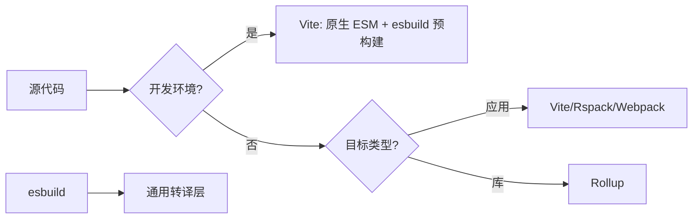

# 一文讲清楚 Webpack、Vite、Rollup、esbuild 对比

> 前端构建工具的演进史，就是一部开发体验与性能优化的奋斗史。从 Webpack 的"大而全"到 Vite 的"快而精"，从 Rollup 的"专注库打包"到 esbuild 的"极致性能"，每个工具都有其独特的设计哲学与应用场景。本文将从多个维度深度对比这四大构建工具，帮助你做出最适合的技术选型。

---

## 📌 目录

- [背景](#背景)
- [演进历史](#演进历史)
- [核心原理对比](#核心原理对比)
- [作用与定位](#作用与定位)
- [性能对比](#性能对比)
- [社区与生态](#社区与生态)
- [插件生态](#插件生态)
- [插件开发](#插件开发)
- [优点](#优点)
- [缺点](#缺点)
- [适用场景](#适用场景)
- [选型建议](#选型建议)
- [未来展望](#未来展望)

---

## 背景

在现代前端开发中,构建工具的选择直接影响项目的开发效率、构建性能和最终产物质量。随着项目规模的增长和复杂度的提升,构建工具的性能瓶颈日益凸显:

- **冷启动慢**:大型项目启动动辄数十秒甚至数分钟
- **热更新延迟**:HMR 响应慢,打断开发思路
- **构建时间长**:CI/CD 流程效率低下
- **配置复杂**:学习成本高,维护困难

这些问题催生了新一代构建工具的诞生,也推动了整个前端工程化领域的快速发展。选择合适的构建工具,已成为每个前端开发者和架构师必须面对的核心决策。

---

## 演进历史

### 前端构建工具发展时间线

```
2012  Webpack 诞生  ──┐
                        │ 传统打包时代
2015  Rollup  发布   ──┘

2018  Webpack 4 成熟 ──┐
                        │ 模块化生态爆发期
2019  Babel 繁荣      ──┘

2020  Vite 发布       ──┐
2020  esbuild 诞生     ├──→ 构建工具性能革命
2022  Rspack 发布     ──┘

2025  Vite 8.0 发布 ───→ Rolldown 单引擎时代
2026  全面 Rust 化   ───→ 性能极致优化
```

### 代际差异

| 时代 | 代表工具 | 核心语言 | 特点 | 性能提升 |
|------|---------|---------|------|---------|
| **第一代** | Webpack, Rollup | JavaScript | 功能强大,生态丰富,但速度慢 | 基准 |
| **第二代** | esbuild | Go | 10-100倍速度提升,功能简化 | 10-100x |
| **第三代** | Vite (早期), Rspack | Go/Rust | 开发体验与性能兼顾 | 10-80x |
| **第四代** | Vite 8.0 (Rolldown) | Rust | 单引擎统一,性能极致 | 15-80x |

**关键转折点**:
- **2020年**:esbuild 用 Go 语言重写,证明了构建工具性能提升的上限
- **2020年**:Vite 利用浏览器原生 ESM,颠覆传统开发模式
- **2025年**:Vite 8.0 采用 Rolldown,统一开发/生产构建链路
- **2026年**:Rust 工具链全面统治,JavaScript 编写的构建工具被边缘化

---

## 核心原理对比

### Webpack:打包优先架构

```javascript
// webpack 核心流程
入口文件 → 递归解析依赖 → 构建完整依赖图 → 编译打包 → 输出 bundle

// 特点
- 开发环境:全量打包后启动服务
- 生产环境:同样打包流程
- 模块系统:支持 CJS/AMD/ESM
```

**时间复杂度**:O(n),n 为模块数量,项目越大启动越慢

### Vite:按需编译架构

```javascript
// vite 核心流程
启动服务 → 浏览器请求模块 → 按需编译 → 返回 ESM

// 关键技术
1. 开发环境:利用浏览器原生 ESM,不打包
2. 依赖预构建:使用 esbuild (Go) 预处理 node_modules
3. 生产构建:委托 Rollup 打包
```

**时间复杂度**:O(1),冷启动与项目规模解耦

### Rollup:ESM 优先架构

```javascript
// rollup 核心流程
静态分析 → Tree Shaking → 优化合并 → 输出纯净 bundle

// 核心优势
- 原生 ESM 支持,Tree Shaking 最优
- 输出代码清晰,无运行时开销
- 专为库打包设计
```

### esbuild:极速并行架构

```go
// esbuild 核心优势
1. Go 语言编写,充分利用多核 CPU
2. 最小化 AST 遍历(仅 3 次)
3. 统一数据结构,避免转换开销
4. 全程并行化处理
```

**性能基准** (生产构建,10 份 three.js):
- esbuild: **0.39s**
- Parcel 2: 14.91s
- Rollup 4 + Terser: 34.10s
- Webpack 5: 41.21s

---

## 作用与定位

| 工具 | 核心定位 | 设计哲学 | 主要职责 |
|------|---------|---------|---------|
| **Webpack** | 应用构建工具 | "一切皆模块" | 处理复杂应用的模块打包、资源处理、代码分割 |
| **Vite** | 开发体验优先工具 | "按需编译" | 极速开发体验 + 生产环境优化打包 |
| **Rollup** | 库打包工具 | "纯净输出" | 为 npm 包生成优化的、tree-shakable 的代码 |
| **esbuild** | 极速编译器 | "性能至上" | 超快转译和基础打包能力 |

### 职责边界



---

## 性能对比

### 开发环境性能

| 指标 | Webpack 5 | Vite | Rollup | esbuild |
|------|----------|------|--------|---------|
| **冷启动** | 8.2s - 30s+ | < 1s (Vite 8.0 < 150ms) | 不适用 | < 100ms |
| **HMR 响应** | 800ms - 2s | < 100ms (Vite 8.0 < 50ms) | 不适用 | < 50ms |
| **内存占用** | 1.2GB+ | 480MB | 不适用 | 120MB |
| **CPU 占用** | 高 | 低 | 不适用 | 低 |

**实测数据** (Vue3 项目,120+ 文件,15000 行代码):

| 构建工具 | 冷启动 | 热启动 | HMR (JS) | HMR (CSS) |
|---------|--------|--------|----------|-----------|
| Webpack 5 | 8.2s | 5s | 800ms-1.2s | 1.8s |
| Vite | 0.8s | 1.2s | < 100ms | < 50ms |
| **提升倍数** | **10x** | **4x** | **10x** | **36x** |

### 生产环境性能

| 指标 | Webpack 5 | Vite (Rollup) | Rollup | esbuild |
|------|----------|---------------|--------|---------|
| **构建时间** | 18.5s - 120s | 6.3s - 81.9s | 49s | 2-5s |
| **输出体积** | 480KB (gzip) | 465KB (gzip) | 最小 | 略大 |
| **Tree Shaking** | 良好 | 优秀 (基于 Rollup) | 最优 | 优秀 |
| **代码分割** | 最强大 | 强 | 基础 | 基础 |

### Vite 8.0 性能飞跃 (2025年9月发布)

| 指标 | Vite 7.x | Vite 8.0 | Webpack 5 |
|------|----------|----------|-----------|
| 冷启动 | 300ms | < 150ms | 28.7s |
| 热更新 | 80ms | < 50ms | 2.1s |
| 生产构建(大项目) | 120s | 8s | 126s |
| Bundle 体积 | 100% | 85% | 105% |

**核心改进**:采用 Rust 编写的 Rolldown 替代 esbuild+Rollup 双引擎,实现从开发到生产的全流程统一。

### esbuild 性能优势案例

**案例 1**:引擎构建优化 (Activepieces, 2026年2月)

| 指标 | Webpack | esbuild | 提升 |
|------|---------|---------|------|
| 构建时间 | ~11s | ~0.4s | **27.5x** |
| 输出体积 | 3.83 MB | 2.2 MB | **-42%** |

**案例 2**:Goji.js 迁移到 Rspack (Rust版 Webpack)

| 指标 | Webpack 5 | Rspack | 提升 |
|------|----------|--------|------|
| 首次开发构建 | ~30s | ~6s | 80% |
| 缓存开发构建 | ~5s | ~1s | 80% |
| 生产构建 | ~120s | ~24s | 80% |
| HMR | 5-10s | <1s | 90% |
| 内存占用 | ~1.2GB | ~720MB | 40% |

---

## 社区与生态

### GitHub Stars 与维护活跃度

| 工具 | GitHub Stars | 维护者 | 最新版本 | 社区活跃度 |
|------|--------------|--------|---------|-----------|
| **Webpack** | 64k+ | webpack team | 5.x | ⭐⭐⭐⭐⭐ 最成熟 |
| **Vite** | 65k+ | Evan You et al. | 8.0 (2025) | ⭐⭐⭐⭐⭐ 爆发式增长 |
| **Rollup** | 25k+ | Rollup Team | 4.x | ⭐⭐⭐⭐ 稳定 |
| **esbuild** | 37k+ | Evan Wallace | 0.20+ | ⭐⭐⭐⭐ 快速迭代 |

### 生态成熟度对比

| 维度 | Webpack | Vite | Rollup | esbuild |
|------|---------|------|--------|---------|
| **文档质量** | 详尽但分散 | 清晰易懂 | 专注库打包 | 简洁 |
| **学习资源** | 极多 | 快速增长 | 适中 | 较少 |
| **问题解决** | 搜索即答案 | 新问题多 | 标准化方案 | 官方响应快 |
| **招聘要求** | 大厂必备 | 越来越多 | 库开发必需 | 少见 |

### 行业采用情况 (2026年)

- **Webpack**:遗留项目、大型企业应用 (仍占 40%+)
- **Vite**:新项目首选,85%+ 新项目采用
- **Rollup**:库打包标准,React、Vue 等框架均使用
- **esbuild**:作为底层工具被 Vite、Rspack 等集成

---

## 插件生态

### 插件数量对比

| 工具 | 插件数量 | 代表插件 |
|------|---------|---------|
| **Webpack** | 3000+ | HtmlWebpackPlugin, MiniCssExtractPlugin, BundleAnalyzerPlugin |
| **Vite** | 800+ (兼容 Rollup) | @vitejs/plugin-vue, @vitejs/plugin-react, vite-plugin-ssr |
| **Rollup** | 500+ | @rollup/plugin-commonjs, @rollup/plugin-node-resolve, @rollup/plugin-typescript |
| **esbuild** | 50+ | esbuild-plugin-copy, esbuild-plugin-env (相对较少) |

### 插件机制对比

#### Webpack 插件系统

```javascript
// Webpack 插件架构 - 基于 Tapable 事件流
class MyPlugin {
  apply(compiler) {
    compiler.hooks.emit.tapAsync('MyPlugin', (compilation, callback) => {
      // 在 emit 阶段介入
      // 可以访问整个 compilation 对象
      callback();
    });
  }
}
```

**特点**:
- 基于 Tapable 发布订阅模式
- 钩子极其丰富(20+ 阶段)
- 可深度干预构建流程
- 学习曲线陡峭

#### Vite 插件系统

```javascript
// Vite 插件 - 兼容 Rollup + 独有钩子
export default function myPlugin() {
  return {
    name: 'my-plugin',
    // Rollup 通用钩子
    resolveId(source) { /* ... */ },
    load(id) { /* ... */ },
    // Vite 独有钩子
    config(config) { /* ... */ },
    configureServer(server) { /* ... */ },
    transformIndexHtml(html) { /* ... */ }
  };
}
```

**特点**:
- 继承 Rollup 插件 API
- 新增开发服务器相关钩子
- 支持热更新中间件
- 生态兼容性强

#### Rollup 插件系统

```javascript
// Rollup 插件 - 简洁清晰
export default function myPlugin() {
  return {
    name: 'my-plugin',
    resolveId(source) { /* ... */ },
    load(id) { /* ... */ },
    transform(code, id) { /* ... */ },
    generateBundle(options, bundle) { /* ... */ }
  };
}
```

**特点**:
- API 设计简洁
- 钩子较少但够用
- 专注构建流程
- 易于上手

#### esbuild 插件系统

```javascript
// esbuild 插件 - Go 实现的 JS API
const myPlugin = {
  name: 'my-plugin',
  setup(build) {
    build.onResolve({ filter: /\.custom$/ }, args => {
      // 模块解析拦截
      return { path: args.path, namespace: 'custom-ns' };
    });

    build.onLoad({ filter: /.*/, namespace: 'custom-ns' }, args => {
      // 模块加载拦截
      return { contents: 'export default "transformed"' };
    });
  }
};

await esbuild.build({
  plugins: [myPlugin],
  // ...
});
```

**特点**:
- 异步钩子支持有限
- 性能优先,功能受限
- 生态相对较小
- 适合简单场景

---

## 插件开发

### Webpack 插件开发

**难度**: ⭐⭐⭐⭐⭐

```javascript
const { Compilation } = require('webpack');

class CompressionPlugin {
  constructor(options = {}) {
    this.options = options;
  }

  apply(compiler) {
    compiler.hooks.compilation.tap('CompressionPlugin', compilation => {
      compilation.hooks.processAssets.tapAsync(
        {
          name: 'CompressionPlugin',
          stage: Compilation.PROCESS_ASSETS_STAGE_OPTIMIZE_SIZE
        },
        (assets, callback) => {
          // 压缩处理逻辑
          Object.keys(assets).forEach(filename => {
            const asset = assets[filename];
            // ... 压缩代码
          });
          callback();
        }
      );
    });
  }
}

module.exports = CompressionPlugin;
```

**关键挑战**:
- 理解 20+ 构建阶段
- 掌握 Compilation 对象结构
- 处理异步逻辑和缓存
- 性能优化

### Vite 插件开发

**难度**: ⭐⭐⭐

```javascript
import type { Plugin } from 'vite';

export function myVitePlugin(): Plugin {
  let server: any;

  return {
    name: 'my-vite-plugin',

    // 配置阶段
    config(config) {
      return {
        // 返回部分配置
      };
    },

    // 配置解析后
    configResolved(config) {
      // 可以读取最终配置
    },

    // 配置开发服务器
    configureServer(devServer) {
      server = devServer;
      devServer.middlewares.use((req, res, next) => {
        // 自定义中间件
        next();
      });
    },

    // 转换 HTML
    transformIndexHtml(html) {
      return html.replace(/<\/title>/, '<script>console.log("injected")</script></title>');
    },

    // 模块解析
    resolveId(source) {
      if (source === 'virtual-module') {
        return '\0virtual-module';
      }
    },

    // 模块加载
    load(id) {
      if (id === '\0virtual-module') {
        return 'export default "virtual content"';
      }
    },

    // 代码转换
    transform(code, id) {
      if (id.endsWith('.custom')) {
        return { code: `// transformed\n${code}` };
      }
    }
  };
}
```

**优势**:
- 生命周期清晰
- Rollup 生态可复用
- 开发服务器易扩展
- TypeScript 支持良好

### Rollup 插件开发

**难度**: ⭐⭐⭐⭐

```javascript
export default function myRollupPlugin() {
  return {
    name: 'my-rollup-plugin',

    // 解析模块 ID
    resolveId(source, importer) {
      // 返回解析后的 ID 或 null
    },

    // 加载模块
    load(id) {
      // 返回模块代码
      return { code: 'export const foo = "bar"', map: null };
    },

    // 转换代码
    transform(code, id) {
      // 转换逻辑
      return { code: transformedCode, map: sourceMap };
    },

    // 监听文件
    watchChange(id) {
      // HMR 触发
    },

    // 生成 bundle 时
    generateBundle(options, bundle) {
      // 访问所有生成的文件
      Object.entries(bundle).forEach(([fileName, fileInfo]) => {
        // 处理输出
      });
    },

    // 写入磁盘前
    writeBundle() {
      // 清理临时文件等
    }
  };
}
```

### esbuild 插件开发

**难度**: ⭐⭐⭐⭐

```javascript
const myPlugin = {
  name: 'my-esbuild-plugin',

  setup(build) {
    // 拦截模块解析
    build.onResolve({ filter: /^@mylib\// }, args => {
      return {
        path: args.path.replace('@mylib/', ''),
        namespace: 'mylib'
      };
    });

    // 拦截模块加载
    build.onLoad({ filter: /.*/, namespace: 'mylib' }, async args => {
      const contents = await fs.readFile(args.path, 'utf8');
      return {
        contents: `// injected\n${contents}`,
        loader: 'js'
      };
    });

    // 开始构建
    build.onStart(() => {
      console.log('Build started');
    });

    // 构建结束
    build.onEnd(result => {
      if (result.errors.length > 0) {
        console.error('Build failed');
      } else {
        console.log('Build succeeded');
      }
    });
  }
};

await esbuild.build({
  entryPoints: ['src/index.js'],
  bundle: true,
  plugins: [myPlugin]
});
```

**限制**:
- 异步操作支持有限
- 文件系统操作受限
- 不支持复杂的 AST 转换
- 插件生态较小

---

## 优点

### Webpack 优点

✅ **生态极其强大**
- 3000+ loader 和 plugin
- 几乎可以处理任何类型的资源
- 丰富的社区解决方案

✅ **功能全面**
- 代码分割 (Code Splitting)
- 热模块替换 (HMR)
- 持久化缓存
- 模块联邦 (Module Federation)

✅ **灵活可定制**
- 高度可配置
- 深度钩子系统
- 支持复杂构建需求

✅ **生产就绪**
- 企业级应用验证
- 成熟的优化策略
- 完善的文档和资源

### Vite 优点

✅ **极速开发体验**
- 冷启动 < 1s (Vite 8.0 < 150ms)
- HMR < 100ms
- 原生 ESM 按需编译

✅ **开箱即用**
- 内置 TypeScript、JSX、CSS 支持
- 零配置启动
- 支持主流框架

✅ **统一体验**
- 开发/生产统一 API
- 兼容 Rollup 插件
- ESM 原生支持

✅ **性能优异**
- 使用 esbuild 预构建
- 生产环境用 Rollup 优化
- 智能依赖缓存

### Rollup 优点

✅ **Tree Shaking 最佳**
- 原生 ESM 静态分析
- 副作用标记精确
- 输出代码最纯净

✅ **输出代码优雅**
- 无运行时开销
- 模块结构清晰
- 易于调试

✅ **库打包首选**
- 多格式输出 (ESM/CJS/UMD/IIFE)
- 按需导入友好
- 主流框架采用

✅ **配置简洁**
- API 设计优雅
- 学习曲线平缓
- 专注核心功能

### esbuild 优点

✅ **极致性能**
- 10-100x 速度提升
- 毫秒级构建
- 无需缓存

✅ **开箱即用**
- 内置 TypeScript/JSX 支持
- CSS 打包能力
- Tree Shaking

✅ **简单易用**
- API 直观
- 配置极少
- 文档清晰

✅ **资源占用低**
- 内存占用小
- CPU 效率高
- 适合 CI/CD

---

## 缺点

### Webpack 缺点

❌ **构建速度慢**
- 冷启动时间随项目规模增长
- HMR 响应慢
- 生产构建时间长

❌ **配置复杂**
- 配置文件冗长
- 概念抽象难懂
- 学习曲线陡峭

❌ **资源占用高**
- 内存占用大 (1GB+)
- CPU 占用高
- 影响开发体验

❌ **过时技术栈**
- 基于 JavaScript 单线程
- 性能优化受限
- 逐步被 Rust 工具替代

### Vite 缺点

❌ **双引擎不一致**
- 开发用 esbuild,生产用 Rollup
- 可能存在行为差异
- Vite 8.0 已用 Rolldown 解决

❌ **生态不如 Webpack**
- 部分场景缺少插件
- 遗留项目迁移成本高
- 特殊 loader 支持有限

❌ **生产构建非最快**
- Rollup 单线程限制
- 大型项目构建较慢
- 不如 Rspack/Turbopack

❌ **兼容性问题**
- 某些 CommonJS 模块有问题
- 需要依赖预构建
- .vite 缓存可能出错

### Rollup 缺点

❌ **不适合应用打包**
- 代码分割能力弱
- 缺少开发服务器
- HMR 支持有限

❌ **性能瓶颈**
- 单线程处理
- 大型项目构建慢
- 内存占用高

❌ **插件生态相对小**
- 插件数量少于 Webpack
- 某些功能需要额外插件
- 社区规模较小

❌ **配置学习成本**
- 高级配置需要深入理解
- 插件开发需要经验
- 调试困难

### esbuild 缺点

❌ **功能不完善**
- 代码分割能力弱
- CSS 处理不够灵活
- 缺少高级优化

❌ **插件生态小**
- 插件数量有限
- 插件 API 功能受限
- 复杂场景无法支持

❌ **不适合生产**
- 输出体积优化不如 Rollup
- 缺少生产环境特性
- 需要配合其他工具

❌ **生态隔离**
- 插件不兼容 Webpack/Rollup
- 迁移成本高
- 社区相对小

---

## 适用场景

### Webpack

✅ **推荐使用场景**
- 大型企业级应用
- 需要深度定制的项目
- 复杂的资源处理需求
- 遗留项目维护
- 需要 Module Federation 的微前端架构
- 团队已有成熟的 Webpack 配置和插件生态

❌ **不推荐使用**
- 新项目启动
- 快速原型开发
- 小型应用
- 追极速开发体验

### Vite

✅ **推荐使用场景**
- 新项目开发 (85%+ 新项目首选)
- Vue/React/Svelte 应用
- 中小型项目
- 追求开发体验的团队
- 需要快速迭代的项目
- 从 Webpack 迁移的新项目

❌ **不推荐使用**
- 深度依赖 Webpack 特殊插件的项目
- 非常复杂的大型应用
- 需要特殊 loader 的遗留代码

### Rollup

✅ **推荐使用场景**
- npm 包开发
- 开源库打包
- 需要极致 Tree Shaking 的场景
- 多格式输出需求
- 组件库开发
- 工具函数库

❌ **不推荐使用**
- 应用开发
- 需要开发服务器的场景
- 复杂代码分割需求

### esbuild

✅ **推荐使用场景**
- 作为底层编译器使用
- 简单项目的快速打包
- TypeScript/JSX 转译
- 开发工具集成
- CI/CD 快速构建

❌ **不推荐使用**
- 复杂应用生产构建
- 需要丰富插件的场景
- 库打包 (不如 Rollup)

---

## 选型建议

### 决策树

```
开始
  │
  ├─ 需要开发 npm 包?
  │   └─ 是 → Rollup
  │   └─ 否 ↓
  │
  ├─ 遗留项目?
  │   └─ 是 → 评估迁移成本
  │           ├─ 低 → 迁移到 Vite/Rspack
  │           └─ 高 → 继续使用 Webpack
  │   └─ 否 ↓
  │
  ├─ 新项目?
  │   └─ 是 → Vite (默认推荐)
  │   └─ 否 ↓
  │
  ├─ 追求极致性能 (大型项目)?
  │   └─ 是 → Rspack (Webpack 兼容) / Turbopack
  │   └─ 否 ↓
  │
  └─ 需要快速原型/简单打包?
      └─ 是 → esbuild
```

### 场景化建议表

| 场景 | 推荐工具 | 备选方案 |
|------|---------|---------|
| **新 Web 应用** | Vite | Rspack, Webpack |
| **npm 包开发** | Rollup | - |
| **React 组件库** | Rollup | - |
| **Vue 应用** | Vite | Nuxt 3 |
| **Next.js 项目** | Next.js 内置 Turbopack | Webpack |
| **大型企业应用** | Rspack | Webpack |
| **微前端架构** | Webpack (Module Federation) | Rspack |
| **简单工具/脚本** | esbuild | Rollup |
| **遗留项目优化** | Rspack (80% Webpack 兼容) | 继续优化 Webpack |

### 迁移路径

**从 Webpack 迁移到 Vite**:
1. 检查依赖是否支持 ESM
2. 替换环境变量 (`process.env` → `import.meta.env`)
3. 调整入口文件 (HTML 作为入口)
4. 替换 Webpack 特定插件
5. 逐步迁移,先迁移简单部分

**从 Webpack 迁移到 Rspack**:
1. 几乎无需修改配置
2. 替换依赖包 (`webpack` → `@rspack/core`)
3. 测试插件兼容性 (80%+ 兼容)
4. 验证构建产物一致性

---

## 未来展望

### 2026-2028 发展趋势

#### 1. Rust 工具链全面统治

JavaScript 编写的构建工具逐步退出历史舞台:
- **Rspack**:替代 Webpack,大型应用首选
- **Rolldown**:Vite 8.0 单引擎,统一开发/生产
- **Turbopack**:Next.js 默认,构建速度 10x 提升
- **Oxlint/Biome**:替代 ESLint/Prettier,速度快 35x

**预测**:到 2028 年,95% 的新项目将采用 Rust 工具链

#### 2. AI 赋能构建工具

- **智能配置生成**:根据项目自动生成最佳配置
- **性能优化建议**:AI 分析构建结果,提供优化方案
- **依赖优化**:自动识别和删除未使用的依赖
- **代码分割建议**:智能分析路由和使用情况

**案例**:Trae (字节跳动) 可通过自然语言描述 2 小时完成网站从零到上线

#### 3. 统一工具链趋势

构建工具不再是独立的工具,而是全栈开发平台的一部分:
- **Vite + Rolldown**:开发/生产统一
- **Nx + Turbopack**:Monorepo 一体化构建
- **Next.js + Turbopack**:全栈框架深度集成

#### 4. 边缘计算与构建

- **边缘预构建**:在边缘节点预构建应用
- **按需构建**:根据用户请求动态构建
- **分布式构建**:利用多节点并行构建

#### 5. WebAssembly 深度应用

- **Wasm 插件系统**:允许用 Rust/C++ 编写插件
- **Wasm 运行时**:在浏览器中运行构建工具
- **跨平台构建**:同一套工具链运行在不同平台

---

## 总结

### 核心观点

| 工具 | 核心价值 | 适用阶段 |
|------|---------|---------|
| **Webpack** | 功能强大,生态成熟 | 遗留项目、大型企业应用 |
| **Vite** | 开发体验极佳 | 新项目、中小型应用 |
| **Rollup** | Tree Shaking 最优 | npm 包、组件库 |
| **esbuild** | 极速编译 | 底层编译器、简单打包 |

### 选型黄金法则

1. **新项目优先选 Vite**:除非有特殊需求,否则 Vite 是默认选择
2. **库打包必选 Rollup**:任何 npm 包都应该用 Rollup 打包
3. **遗留项目评估迁移成本**:低则迁移到 Vite/Rspack,高则继续优化 Webpack
4. **大型项目考虑 Rspack/Turbopack**:性能瓶颈明显时,必须切换到 Rust 工具链
5. **esbuild 作为底层工具**:很少单独使用,通常作为其他工具的底层编译器

### 最终建议

**对于个人开发者/小团队**:
- 新项目:直接上 Vite
- 库开发:使用 Rollup
- 不需要纠结 Webpack

**对于中型团队**:
- 统一技术栈,优先 Vite
- 特殊场景使用 Rspack
- 建立自己的脚手架和最佳实践

**对于大型企业**:
- 制定迁移计划,逐步替换 Webpack
- 大型应用考虑 Rspack (Webpack 兼容)
- 投入资源构建内部工具链
- 关注 Rust 工具链,培养相关能力

---

> **技术选型没有银弹,只有最适合当前团队的方案。理解工具的本质,拥抱变化,持续优化,才是工程师的核心竞争力。**

---

## 参考资源

- [Webpack 官方文档](https://webpack.js.org/)
- [Vite 官方文档](https://vitejs.dev/)
- [Rollup 官方文档](https://rollupjs.org/)
- [esbuild 官方文档](https://esbuild.github.io/)
- [Rspack 官方文档](https://rspack.dev/)
- [Rolldown GitHub](https://github.com/rollup/rolldown)

---

*更新时间:2026年2月26日*
*作者:基于最新技术动态整理*
